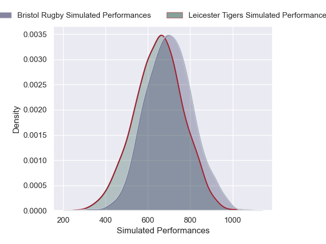
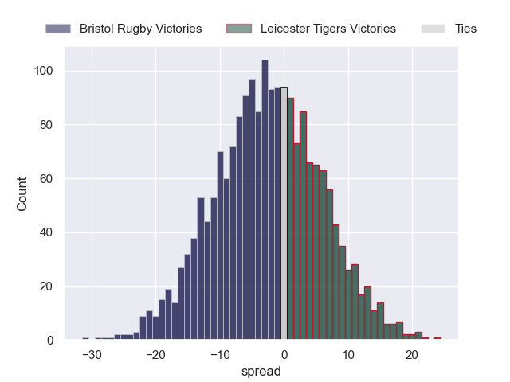

---  
layout: page  
title: Bristol Rugby at Leicester Tigers  
date: 2024-12-21 18:00:00 -0500  
categories: "Gallagher Premiership 2024" match projection  
---
# Bristol Rugby at Leicester Tigers

# Club Level Predictions

The first set of predictions treats a club as the smallest object, as the club develops its members, organizes a gameplan, and deploys its players as needed for each match. This club model has a prediction of 0.476, which translates to predicting Bristol Rugby to win by -3.0.

Our Over/Under is 52.5 - and combined with the spread above, we have a predicted scoreline of 25 to 28

Each club has a rating and a rating deviation (similar to a Glicko rating), and expected performances can be generated. This allows for simulated matches and spreads like the ones below.
## Projected Performances - Club Model

## Projected Spreads - Club Model

## Projected Results - Club Model

# Player Level Predictions

Treating teams instead as an entity made up of the currently active players, I have ratings for each player in an altogether different system. These can be combined to form team ratings once teamsheets are announced, weighting starters a bit higher than the reserves. After the match is played, players can be weighted by their minutes on the field, allowing for an accurate measure of the team's composition. With these compiled team ratings, we can make predictions, measure inaccuracy, and update the individual player ratings.
## Prediction without Player Minutes: Bristol Rugby by 2.3

Bristol Rugby by 17.7 on a neutral pitch

## Projected Performances - Player Model

## Projected Spreads - Player Model

## Projected Results - Player Model

| Away Player                |   Away Percentile |   Number |   Home Percentile | Home Player           |
|:---------------------------|------------------:|---------:|------------------:|:----------------------|
| Ellis Genge                |             54.78 |        1 |             58.68 | Nicky Smith           |
| Gabriel Oghre              |             76.68 |        2 |             91.24 | Julian Montoya        |
| Max Lahiff                 |             88.61 |        3 |             84.36 | Joe Heyes             |
| James Dun                  |             91.83 |        4 |            nan    | Cameron Henderson     |
| Joe Owen                   |             27.35 |        5 |             94.05 | George Martin         |
| Steven Luatua              |             99.29 |        6 |             71.81 | Hanro Liebenberg      |
| Fitz Harding               |             96.57 |        7 |             21.25 | Tommy Reffell         |
| Viliame Mata               |             26.88 |        8 |             24.77 | Olly Cracknell        |
| Harry Randall              |             96.39 |        9 |             83.44 | Ben Youngs            |
| AJ MacGinty                |             97.17 |       10 |             91.11 | Handre Pollard        |
| Gabriel Ibitoye            |             97.3  |       11 |             79.49 | Ollie Hassell-Collins |
| Benhard Janse van Rensburg |             96.56 |       12 |             57.03 | Solomone Kata         |
| Kalaveti Ravouvou          |             73.68 |       13 |            nan    | Will Wand             |
| Jack Bates                 |             38.31 |       14 |             85.85 | Josh Bassett          |
| Richard Lane               |             58.24 |       15 |              4.49 | Freddie Steward       |
| Harry Thacker              |             77.31 |       16 |             18.78 | Charlie Clare         |
| Jake Woolmore              |             86.66 |       17 |             67.06 | James Whitcombe       |
| George Kloska              |             78.16 |       18 |             71.43 | Will Hurd             |
| Jamie Hodgson              |             94.49 |       19 |             17.41 | Jed Holloway          |
| Benjamin Grondona          |             65.77 |       20 |             69.84 | Emeka Ilione          |
| Kieran Marmion             |             94.75 |       21 |             70.33 | Jack van Poortvliet   |
| Sam Worsley                |             30.91 |       22 |             69.9  | Jamie Shillcock       |
| Benjamin Elizalde          |             29.4  |       23 |             61.34 | Joseph Woodward       |

