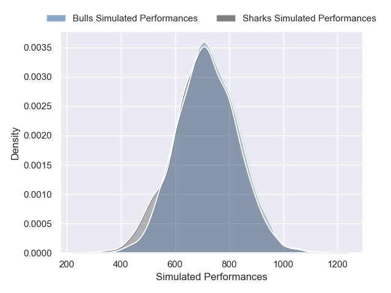
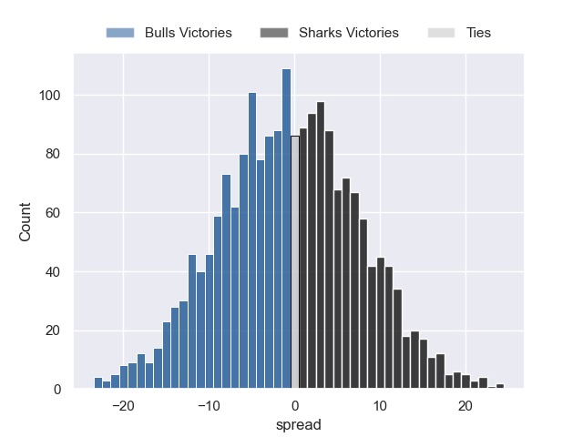

---  
layout: page  
title: Bulls at Sharks  
date: 2024-12-21 18:00:00 -0500  
categories: "United Rugby Championship 2024" match projection  
---
# Bulls at Sharks

# Club Level Predictions

The first set of predictions treats a club as the smallest object, as the club develops its members, organizes a gameplan, and deploys its players as needed for each match. This club model has a prediction of 0.352, which translates to predicting Bulls to win by 2.8.

Our Over/Under is 62.5 - and combined with the spread above, we have a predicted scoreline of 33 to 30

Each club has a rating and a rating deviation (similar to a Glicko rating), and expected performances can be generated. This allows for simulated matches and spreads like the ones below.
## Projected Performances - Club Model

## Projected Spreads - Club Model

## Projected Results - Club Model

# Player Level Predictions

Treating teams instead as an entity made up of the currently active players, I have ratings for each player in an altogether different system. These can be combined to form team ratings once teamsheets are announced, weighting starters a bit higher than the reserves. After the match is played, players can be weighted by their minutes on the field, allowing for an accurate measure of the team's composition. With these compiled team ratings, we can make predictions, measure inaccuracy, and update the individual player ratings.
## Prediction without Player Minutes: Bulls by 0.5

Bulls by 8.6 on a neutral pitch

## Projected Performances - Player Model

## Projected Spreads - Player Model

## Projected Results - Player Model

| Away Player         |   Away Percentile |   Number |   Home Percentile | Home Player       |
|:--------------------|------------------:|---------:|------------------:|:------------------|
| Gerhard Steenekamp  |             87.78 |        1 |             91.26 | Ox Nche           |
| Akker van der Merwe |             96.24 |        2 |             34.12 | Dylan Richardson  |
| Wilco Louw          |             90.67 |        3 |             82.7  | Vincent Koch      |
| Ruan Vermaak        |             14.74 |        4 |             68.03 | Jason Jenkins     |
| JF van Heerden      |             35.26 |        5 |             59.95 | Emile van Heerden |
| Cameron Hanekom     |             67.57 |        6 |             67.69 | Phepsi Buthelezi  |
| Cobus Wiese         |             96.92 |        7 |             53.3  | Emmanuel Tshituka |
| Elrigh Louw         |             96.74 |        8 |             78.53 | Siya Kolisi       |
| Embrose Papier      |             93.61 |        9 |             94.1  | Jaden Hendrikse   |
| Johan Goosen        |             70.1  |       10 |             79.03 | Jordan Hendrikse  |
| Canan Moodie        |             99.9  |       11 |             99.76 | Makazole Mapimpi  |
| Harold Vorster      |             95.69 |       12 |             99.23 | Andre Esterhuizen |
| Stedman Gans        |             86.41 |       13 |             55.89 | Ethan Hooker      |
| Sebastian de Klerk  |             95.71 |       14 |             44.28 | Yaw Penxe         |
| Willie le Roux      |             97    |       15 |             94.01 | Aphelele Fassi    |
| Johan Grobbelaar    |             92.02 |       16 |            nan    | Ethan Bester      |
| Jan-Hendrik Wessels |             70.54 |       17 |             90.32 | Ruan Dreyer       |
| Francois Klopper    |             62.69 |       18 |             83.35 | Trevor Nyakane    |
| Sintu Manjezi       |             92.36 |       19 |             17.05 | Corne Rahl        |
| Marcell Coetzee     |             96.66 |       20 |             45.95 | Nick Hatton       |
| Keagan Johannes     |             56.16 |       21 |              4.26 | Cameron Wright    |
| Sergeal Petersen    |             96.34 |       22 |             69.49 | Siya Masuku       |
| Devon Williams      |             92.77 |       23 |             77.89 | Jurenzo Julius    |

