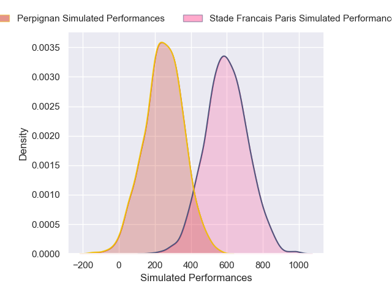
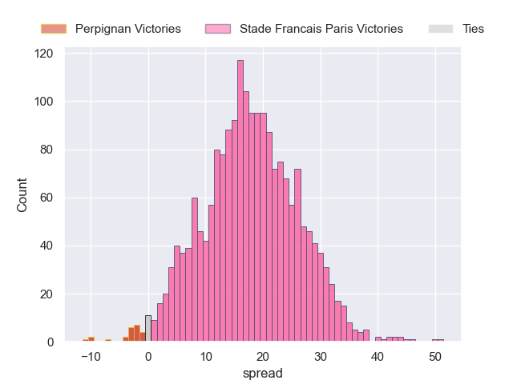
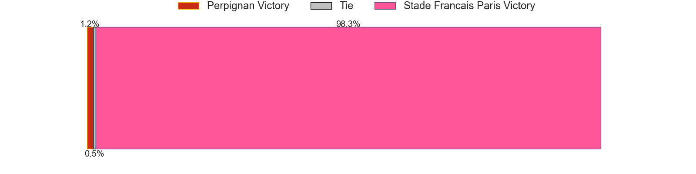

---  
layout: page  
title: Perpignan at Stade Francais Paris  
date: 2024-12-21 18:00:00 -0500  
categories: "Top 14 2024" match projection  
---
# Perpignan at Stade Francais Paris

# Club Level Predictions

The first set of predictions treats a club as the smallest object, as the club develops its members, organizes a gameplan, and deploys its players as needed for each match. This club model has a prediction of 0.568, which translates to predicting Stade Francais Paris to win by 6.3.

Our Over/Under is 45.5 - and combined with the spread above, we have a predicted scoreline of 19 to 26

Each club has a rating and a rating deviation (similar to a Glicko rating), and expected performances can be generated. This allows for simulated matches and spreads like the ones below.
## Projected Performances - Club Model

## Projected Spreads - Club Model

## Projected Results - Club Model

# Player Level Predictions

Treating teams instead as an entity made up of the currently active players, I have ratings for each player in an altogether different system. These can be combined to form team ratings once teamsheets are announced, weighting starters a bit higher than the reserves. After the match is played, players can be weighted by their minutes on the field, allowing for an accurate measure of the team's composition. With these compiled team ratings, we can make predictions, measure inaccuracy, and update the individual player ratings.
## Prediction without Player Minutes: Stade Francais Paris by 17.7

Stade Francais Paris by 2.3 on a neutral pitch

## Projected Performances - Player Model

## Projected Spreads - Player Model

## Projected Results - Player Model

| Away Player              |   Away Percentile |   Number |   Home Percentile | Home Player              |
|:-------------------------|------------------:|---------:|------------------:|:-------------------------|
| Giorgi Beria             |             76.45 |        1 |             44.27 | Moses Alo-Emile          |
| Ignacio Ruiz             |             94.99 |        2 |             95.77 | Giacomo Nicotera         |
| Kieran Brookes           |             23.55 |        3 |             70.72 | Paul Alo-Emile           |
| Max Hicks                |             58.53 |        4 |              7.46 | Paul Gabrillagues        |
| Adrien Warion            |             26.73 |        5 |             88.01 | JJ van der Mescht        |
| Lucas Velarte            |             26.39 |        6 |             13.94 | Tanginoa Halaifonua      |
| Noe Della Schiava        |             27.08 |        7 |             51.33 | Ryan Chapuis             |
| Joaquin Oviedo           |             79.13 |        8 |             17.27 | Juan Martin Scelzo       |
| Tom Ecochard             |             56.89 |        9 |             97.38 | Brad Weber               |
| Tommaso Allan            |             68.69 |       10 |             66.06 | Louis Carbonel           |
| Ali Crossdale            |              2.43 |       11 |             38.24 | Charles Laloi            |
| Jeronimo de la Fuente    |             97.61 |       12 |             75.98 | Jeremy Ward              |
| Alivereti Duguivalu      |              5.84 |       13 |             31.48 | Joe Marchant             |
| Tavite Veredamu          |             73.21 |       14 |             80.37 | Peniasi Dakuwaqa         |
| nan                      |            nan    |       15 |             72.66 | Leo Barre                |
| Seilala Lam              |             56.96 |       16 |             12.52 | Lucas Peyresblanques     |
| Nemo Roelofse            |             41.79 |       17 |             39.08 | Hugo Ndiaye              |
| Alessandro Ortombina (2) |            nan    |       18 |             60.66 | Setareki Turagacoke      |
| So'otala Fa'aso'o        |             77.63 |       19 |             18.59 | Andy Timo                |
| James Hall               |             19.18 |       20 |             18.18 | Louis Foursans-Bourdette |
| nan                      |            nan    |       21 |             42.04 | Yoan Tanga               |
| nan                      |            nan    |       22 |             14.79 | Samuel Ezeala            |
| nan                      |            nan    |       23 |             80.34 | Francisco Gomez Kodela   |

