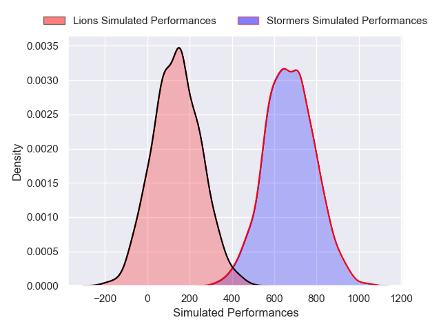
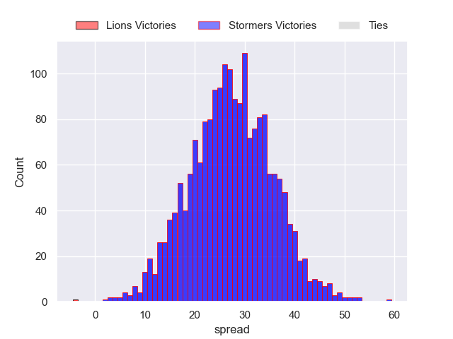
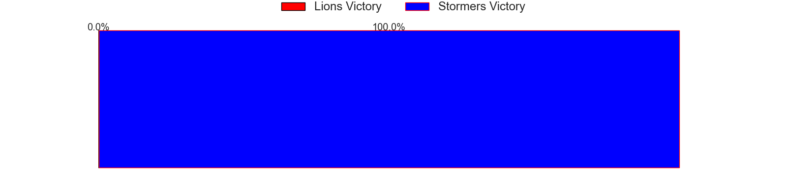

---  
layout: page  
title: Lions at Stormers  
date: 2024-12-21 18:00:00 -0500  
categories: "United Rugby Championship 2024" match projection  
---
# Lions at Stormers

# Club Level Predictions

The first set of predictions treats a club as the smallest object, as the club develops its members, organizes a gameplan, and deploys its players as needed for each match. This club model has a prediction of 0.482, which translates to predicting Lions to win by -3.3.

Our Over/Under is 51.5 - and combined with the spread above, we have a predicted scoreline of 24 to 27

Each club has a rating and a rating deviation (similar to a Glicko rating), and expected performances can be generated. This allows for simulated matches and spreads like the ones below.
## Projected Performances - Club Model

## Projected Spreads - Club Model

## Projected Results - Club Model

# Player Level Predictions

Treating teams instead as an entity made up of the currently active players, I have ratings for each player in an altogether different system. These can be combined to form team ratings once teamsheets are announced, weighting starters a bit higher than the reserves. After the match is played, players can be weighted by their minutes on the field, allowing for an accurate measure of the team's composition. With these compiled team ratings, we can make predictions, measure inaccuracy, and update the individual player ratings.
## Prediction without Player Minutes: Stormers by 27.3

Stormers by 18.8 on a neutral pitch

## Projected Performances - Player Model

## Projected Spreads - Player Model

## Projected Results - Player Model

| Away Player            |   Away Percentile |   Number |   Home Percentile | Home Player               |
|:-----------------------|------------------:|---------:|------------------:|:--------------------------|
| Juan Schoeman          |             26.86 |        1 |             75.86 | Alistair Vermaak          |
| PJ Botha               |             39.75 |        2 |             84.66 | Joseph Dweba              |
| Asenathi Ntlabakanye   |             48.52 |        3 |             81.11 | Frans Malherbe            |
| Ruben Schoeman         |             19.09 |        4 |             83.04 | Salmaan Moerat            |
| Ruan Delport           |             22.82 |        5 |             35.7  | JD Schickerling           |
| Jarod Cairns           |             29.31 |        6 |             94.52 | Deon Fourie               |
| WJ Steenkamp           |             28.45 |        7 |             88.17 | Ben-Jason Dixon           |
| Francke Horn           |             81.83 |        8 |             54.5  | Marcel Theunissen         |
| Morne van den Berg     |              0.66 |        9 |             93.28 | Herschel Jantjies         |
| Sam Francis            |             45.86 |       10 |             86.67 | Manie Libbok              |
| Edwill van der Merwe   |             87.6  |       11 |             85.61 | Leolin Zas                |
| Marius Louw            |             87.27 |       12 |             81.21 | Sacha Feinberg-Mngomezulu |
| Erich Cronje           |             11.96 |       13 |             30.43 | Ruhan Nel                 |
| Rabz Maxwane           |             25.12 |       14 |             74.72 | Suleiman Hartzenberg      |
| Tapiwa Mafura          |             79.78 |       15 |             98.31 | Warrick Gelant            |
| Franco Marais          |             26.6  |       16 |              3.13 | JJ Kotze                  |
| Morgan Naude           |             34.24 |       17 |             91.15 | Brok Harris               |
| Conraad van Vuuren     |             28.69 |       18 |             80.52 | Neethling Fouche          |
| Darrien-Lane Landsberg |             48.22 |       19 |             85.52 | Adre Smith                |
| Izan Esterhuizen       |             39.85 |       20 |             54.05 | Willie Engelbrecht        |
| JC Pretorius           |             68.29 |       21 |            nan    | Paul De Villiers          |
| Sanele Nohamba         |             91.92 |       22 |             84.26 | Paul de Wet               |
| Manuel Rass            |             16.75 |       23 |             32.63 | Jean-Luc du Plessis       |

