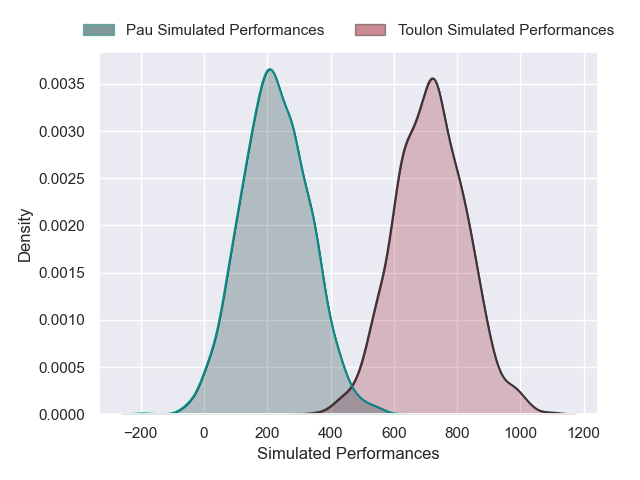
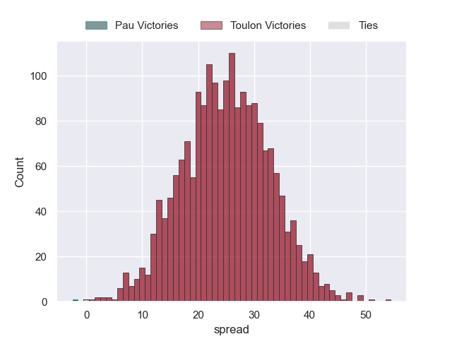
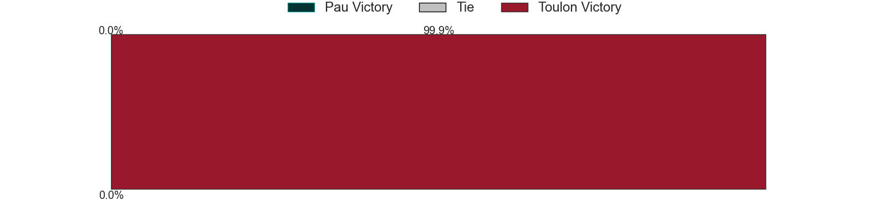

---  
layout: page  
title: Pau at Toulon  
date: 2024-12-21 18:00:00 -0500  
categories: "Top 14 Orange 2024" match projection  
---
# Pau at Toulon

# Club Level Predictions

The first set of predictions treats a club as the smallest object, as the club develops its members, organizes a gameplan, and deploys its players as needed for each match. This club model has a prediction of 0.646, which translates to predicting Toulon to win by 10.0.

Our Over/Under is 45.5 - and combined with the spread above, we have a predicted scoreline of 18 to 28

Each club has a rating and a rating deviation (similar to a Glicko rating), and expected performances can be generated. This allows for simulated matches and spreads like the ones below.
## Projected Performances - Club Model

## Projected Spreads - Club Model

## Projected Results - Club Model

# Player Level Predictions

Treating teams instead as an entity made up of the currently active players, I have ratings for each player in an altogether different system. These can be combined to form team ratings once teamsheets are announced, weighting starters a bit higher than the reserves. After the match is played, players can be weighted by their minutes on the field, allowing for an accurate measure of the team's composition. With these compiled team ratings, we can make predictions, measure inaccuracy, and update the individual player ratings.
## Prediction without Player Minutes: Toulon by 25.0

Toulon by 13.4 on a neutral pitch

## Projected Performances - Player Model

## Projected Spreads - Player Model

## Projected Results - Player Model

| Away Player         |   Away Percentile |   Number |   Home Percentile | Home Player            |
|:--------------------|------------------:|---------:|------------------:|:-----------------------|
| Daniel Bibi Biziwu  |             17.59 |        1 |             87.13 | Dany Priso             |
| Youri Delhommel     |             64.95 |        2 |             74.02 | Gianmarco Lucchesi     |
| Guram Papidze       |             33.29 |        3 |             74.62 | Beka Gigashvili        |
| Lekima Tagitagivalu |             76.09 |        4 |             65.1  | Matthias Halagahu      |
| Remi Picquette      |             34.81 |        5 |             89.25 | David Ribbans          |
| Reece Hewat         |             79.26 |        6 |             80.81 | Matteo Le Corvec       |
| Loic Credoz         |             18.17 |        7 |             98.63 | Charles Ollivon        |
| Sacha Zegueur       |             26.58 |        8 |             73.57 | Selevasio Tolofua      |
| Thibault Daubagna   |             87.7  |        9 |             99.34 | Baptiste Serin         |
| Joe Simmonds        |             67.68 |       10 |             78.38 | Paolo Garbisi          |
| Tumua Manu          |             90.62 |       11 |             83.39 | Gabin Villiere         |
| Nathan Decron       |             61.91 |       12 |            nan    | Jeremy Paul Toevalu    |
| Emilien Gailleton   |             62.11 |       13 |             89.47 | Leicester Fainga'anuku |
| Aymeric Luc         |             20.04 |       14 |             54.05 | Gael Drean             |
| Jack Maddocks       |             74.34 |       15 |             65.73 | Marius Domon           |
| Romain Ruffenach    |             57.12 |       16 |             88.11 | Mickael Ivaldi         |
| Remi Seneca         |             58.5  |       17 |            nan    | Daniel Brennan         |
| Hugo Auradou        |             33.93 |       18 |             80.55 | Brian Alainu'uese      |
| Joel Kpoku          |             69.75 |       19 |             77.04 | Jules Coulon           |
| Mehdi Tlili         |             71.29 |       20 |             85.86 | Enzo Herve             |
| Thomas Souverbie    |             56.56 |       21 |             71.15 | Jules Danglot          |
| Axel Desperes       |             89.29 |       22 |             84.18 | Seta Tuicuvu           |
| Jon Zabala          |             68.06 |       23 |             89.08 | Kyle Sinckler          |

