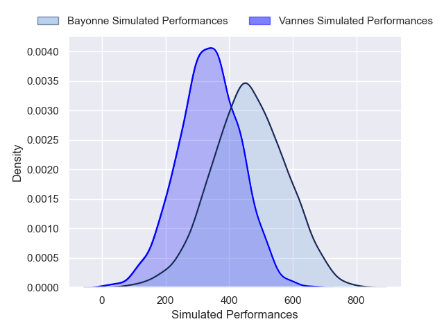
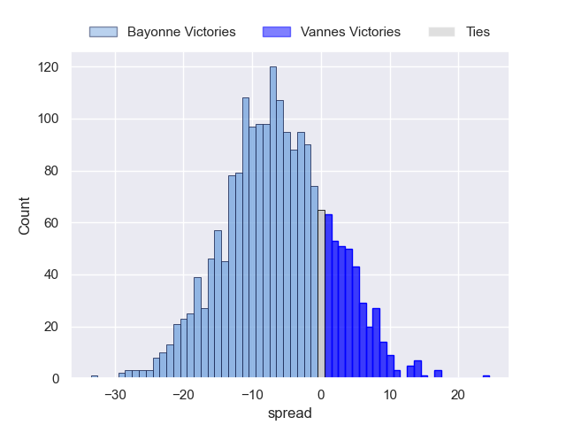
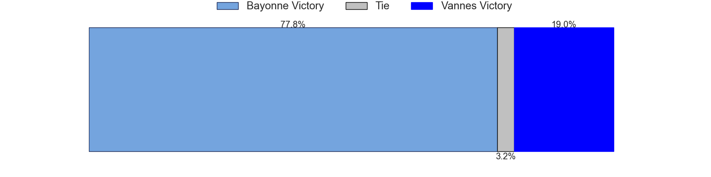

---  
layout: page  
title: Bayonne at Vannes  
date: 2024-12-21 18:00:00 -0500  
categories: "Top 14 2024" match projection  
---
# Bayonne at Vannes

# Club Level Predictions

The first set of predictions treats a club as the smallest object, as the club develops its members, organizes a gameplan, and deploys its players as needed for each match. This club model has a prediction of 0.403, which translates to predicting Bayonne to win by -0.4.

Our Over/Under is 45.5 - and combined with the spread above, we have a predicted scoreline of 22 to 23

Each club has a rating and a rating deviation (similar to a Glicko rating), and expected performances can be generated. This allows for simulated matches and spreads like the ones below.
## Projected Performances - Club Model

## Projected Spreads - Club Model

## Projected Results - Club Model

# Player Level Predictions

Treating teams instead as an entity made up of the currently active players, I have ratings for each player in an altogether different system. These can be combined to form team ratings once teamsheets are announced, weighting starters a bit higher than the reserves. After the match is played, players can be weighted by their minutes on the field, allowing for an accurate measure of the team's composition. With these compiled team ratings, we can make predictions, measure inaccuracy, and update the individual player ratings.
## Prediction without Player Minutes: Bayonne by 6.2

Bayonne by 11.6 on a neutral pitch

## Projected Performances - Player Model

## Projected Spreads - Player Model

## Projected Results - Player Model

| Away Player             |   Away Percentile |   Number |   Home Percentile | Home Player         |
|:------------------------|------------------:|---------:|------------------:|:--------------------|
| Swan Cormenier          |             76.15 |        1 |            nan    | nan                 |
| Lucas Martin            |             91.55 |        2 |            nan    | nan                 |
| Pascal Cotet            |             24.09 |        3 |            nan    | nan                 |
| Baptiste Chouzenoux     |             94.58 |        4 |            nan    | nan                 |
| Lucas Paulos            |             16.52 |        5 |            nan    | nan                 |
| Rodrigo Bruni           |             83.78 |        6 |             15    | Simon Augry         |
| Esteban Capilla         |             22.54 |        7 |             98.2  | Francisco Gorrissen |
| Giovanni Habel-Kueffner |             90.57 |        8 |             52.7  | Sione Kalamafoni    |
| Maxime Machenaud        |             96.72 |        9 |             96.23 | Michael Ruru        |
| Joris Segonds           |             75.56 |       10 |             93.33 | Maxime Lafage       |
| Tom Spring              |             14.39 |       11 |             84.58 | Salesi Rayasi       |
| Manu Tuilagi            |             99.04 |       12 |              3.54 | Francis Saili       |
| Sireli Maqala           |             63.35 |       13 |             47.08 | Theo Costosseque    |
| Mateo Carreras          |             70.19 |       14 |             78.93 | Enzo Benmegal       |
| Cheikh Tiberghien       |             16.1  |       15 |             68.54 | Paul Surano         |
| Torsten van Jaarsveld   |             92.96 |       16 |             78.25 | Pat Leafa           |
| Andy Bordelai           |             81.64 |       17 |            nan    | Hugo Djehi          |
| Veikoso Poloniati       |              4.35 |       18 |             84.37 | Anton Bresler       |
| Baptiste Heguy          |             80.29 |       19 |             84.99 | Timothe Mezou       |
| Uzair Cassiem           |             45.65 |       20 |             34.19 | Leon Boulier        |
| Guillaume Rouet         |             14.75 |       21 |              9.34 | Jules Le Bail       |
| Camille Lopez           |             83.84 |       22 |             65.84 | Tani Vili           |
| Luke Tagi               |             79.4  |       23 |             75.15 | Simon Bourgeois     |

