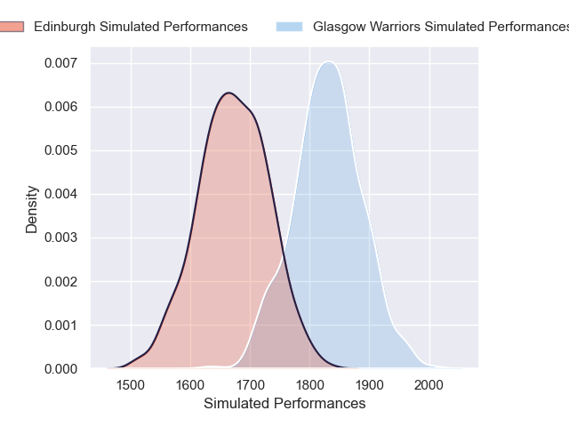
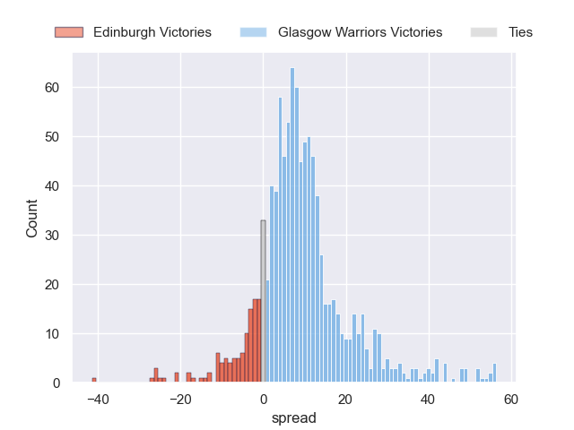
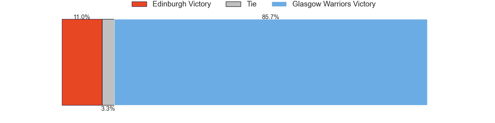
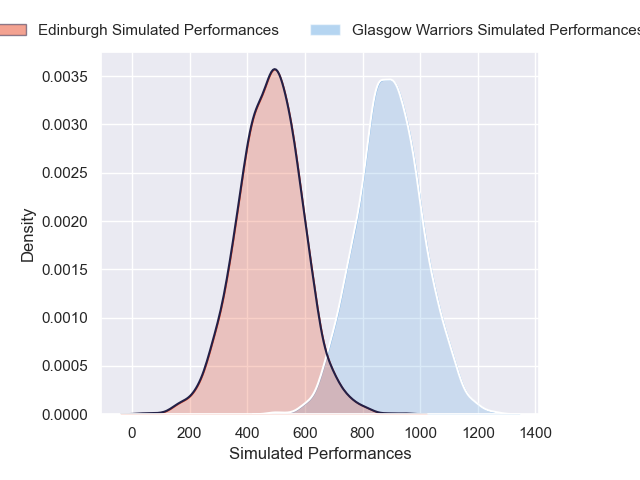
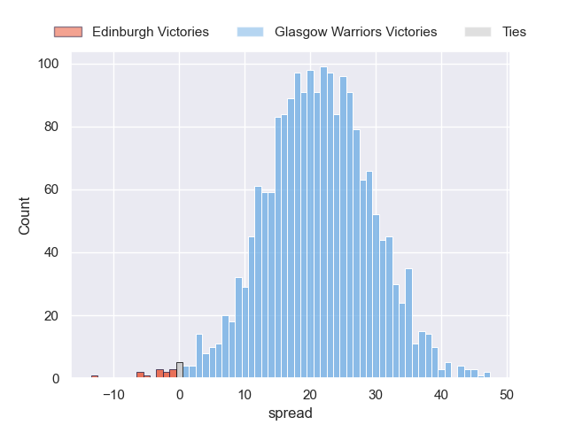
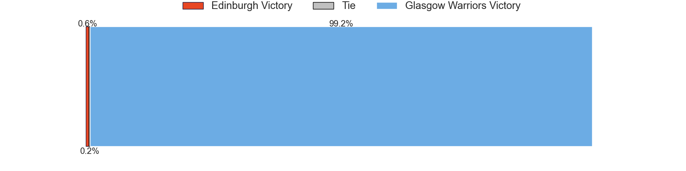

---  
layout: page  
title: Edinburgh at Glasgow Warriors  
date: 2024-12-22 18:00:00 -0500  
categories: "United Rugby Championship 2024" match projection  
---
# Edinburgh at Glasgow Warriors

# Club Level Predictions

The first set of predictions treats a club as the smallest object, as the club develops its members, organizes a gameplan, and deploys its players as needed for each match. This club model has a prediction of 0.629, which translates to predicting Glasgow Warriors to win by 9.8.

Our Over/Under is 42.5 - and combined with the spread above, we have a predicted scoreline of 16 to 26

Each club has a rating and a rating deviation (similar to a Glicko rating), and expected performances can be generated. This allows for simulated matches and spreads like the ones below.
## Projected Performances - Club Model

## Projected Spreads - Club Model

## Projected Results - Club Model

# Player Level Predictions

Treating teams instead as an entity made up of the currently active players, I have ratings for each player in an altogether different system. These can be combined to form team ratings once teamsheets are announced, weighting starters a bit higher than the reserves. After the match is played, players can be weighted by their minutes on the field, allowing for an accurate measure of the team's composition. With these compiled team ratings, we can make predictions, measure inaccuracy, and update the individual player ratings.
## Prediction without Player Minutes: Glasgow Warriors by 21.1

Glasgow Warriors by 11.5 on a neutral pitch

## Projected Performances - Player Model

## Projected Spreads - Player Model

## Projected Results - Player Model

| Away Player         |   Away Percentile |   Number |   Home Percentile | Home Player           |
|:--------------------|------------------:|---------:|------------------:|:----------------------|
| Pierre Schoeman     |             83.06 |        1 |             89.91 | Jamie Bhatti          |
| Ewan Ashman         |             81.69 |        2 |             70.89 | Johnny Matthews       |
| D'Arcy Rae          |             46.04 |        3 |             90.91 | Zander Fagerson       |
| Marshall Sykes      |             89.96 |        4 |             85.26 | Gregor Brown          |
| Grant Gilchrist     |             93.69 |        5 |             99.47 | Scott Cummings        |
| Jamie Ritchie       |             99.14 |        6 |             35.82 | Ally Miller           |
| Luke Crosbie        |             94.6  |        7 |             97.34 | Matt Fagerson         |
| Magnus Bradbury     |             62.31 |        8 |             32.43 | Jack Mann             |
| Ali Price           |             91.64 |        9 |             99.84 | George Horne          |
| Ross Thompson       |             85.66 |       10 |             59.39 | Tom Jordan            |
| Duhan van der Merwe |             84.42 |       11 |             99.13 | Kyle Steyn            |
| Mosese Tuipulotu    |             32.25 |       12 |             91.67 | Sione Tuipulotu       |
| Matt Currie         |             87.85 |       13 |             84.31 | Huw Jones             |
| Darcy Graham        |             47.14 |       14 |             99.28 | Sebastian Cancelliere |
| Wes Goosen          |             92.7  |       15 |             88.24 | Kyle Rowe             |
| Dave Cherry         |             60.88 |       16 |             76.06 | Gregor Hiddleston     |
| Boan Venter         |             30.52 |       17 |             74.14 | Rory Sutherland       |
| Javan Sebastian     |             65.82 |       18 |            nan    | Patrick Schickerling  |
| Sam Skinner         |             81.79 |       19 |             75.04 | Alex Samuel           |
| Ben Muncaster       |             44.3  |       20 |             10.33 | Grant Stewart         |
| Ben Vellacott       |             84.1  |       21 |             39.91 | Angus Fraser          |
| Ben Healy           |             80    |       22 |             93.48 | Jamie Dobie           |
| James Lang          |             85.77 |       23 |             87.47 | Duncan Weir           |

