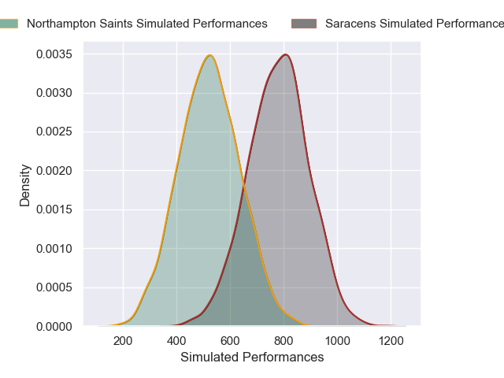
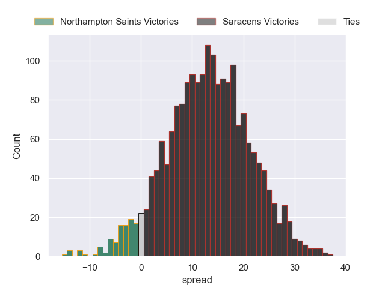
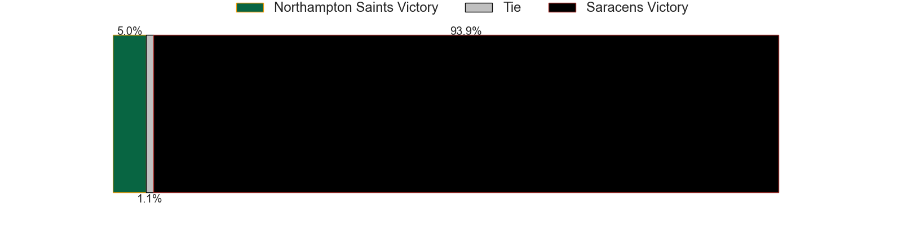

---  
layout: page  
title: Northampton Saints at Saracens  
date: 2024-12-22 18:00:00 -0500  
categories: "Gallagher Premiership 2024" match projection  
---
# Northampton Saints at Saracens

# Club Level Predictions

The first set of predictions treats a club as the smallest object, as the club develops its members, organizes a gameplan, and deploys its players as needed for each match. This club model has a prediction of 0.531, which translates to predicting Saracens to win by 4.5.

Our Over/Under is 52.5 - and combined with the spread above, we have a predicted scoreline of 24 to 28

Each club has a rating and a rating deviation (similar to a Glicko rating), and expected performances can be generated. This allows for simulated matches and spreads like the ones below.
## Projected Performances - Club Model

## Projected Spreads - Club Model

## Projected Results - Club Model

# Player Level Predictions

Treating teams instead as an entity made up of the currently active players, I have ratings for each player in an altogether different system. These can be combined to form team ratings once teamsheets are announced, weighting starters a bit higher than the reserves. After the match is played, players can be weighted by their minutes on the field, allowing for an accurate measure of the team's composition. With these compiled team ratings, we can make predictions, measure inaccuracy, and update the individual player ratings.
## Prediction without Player Minutes: Saracens by 13.4

Saracens by 2.2 on a neutral pitch

## Projected Performances - Player Model

## Projected Spreads - Player Model

## Projected Results - Player Model

| Away Player         |   Away Percentile |   Number |   Home Percentile | Home Player          |
|:--------------------|------------------:|---------:|------------------:|:---------------------|
| Emmanuel Iyogun     |             58.21 |        1 |             48.23 | Rhys Carre           |
| Curtis Langdon      |             94.05 |        2 |             79.81 | Theo Dan             |
| Trevor Davison      |             90.97 |        3 |             22.67 | Fraser Balmain       |
| Tom Lockett         |             12.88 |        4 |             98.85 | Maro Itoje           |
| Chunya Munga        |             84.46 |        5 |             35.13 | Theo McFarland       |
| Alex Coles          |             17.65 |        6 |             95.72 | Juan Martin Gonzalez |
| Tom Pearson         |             97.09 |        7 |             98.46 | Ben Earl             |
| Juarno Augustus     |             50.75 |        8 |             48.95 | Tom Willis           |
| Alex Mitchell       |             95.41 |        9 |             88.03 | Ivan van Zyl         |
| Fin Smith           |             72.73 |       10 |             68.89 | Fergus Burke         |
| James Ramm          |             69.66 |       11 |             98.65 | Liam Williams        |
| Rory Hutchinson     |             86.22 |       12 |             99.71 | Nick Tompkins        |
| Tom Litchfield      |             72.15 |       13 |             76.94 | Lucio Cinti          |
| Tommy Freeman       |             98.17 |       14 |             73.53 | Tobias Elliott       |
| George Hendy        |             93    |       15 |             90.26 | Elliot Daly          |
| Nathan Langdon      |            nan    |       16 |             97.03 | Jamie George         |
| Tarek Haffar        |            nan    |       17 |             21.9  | Phil Brantingham     |
| Elliot Millar Mills |             86.78 |       18 |             75.44 | Alec Clarey          |
| Temo Mayanavanua    |             99.02 |       19 |             89    | Harry Wilson         |
| Henry Pollock       |             93.92 |       20 |             66.75 | Toby Knight          |
| Archie McParland    |             92.79 |       21 |             28.03 | Gareth Simpson       |
| Fraser Dingwall     |             78.37 |       22 |             92.25 | Alex Lozowski        |
| Ollie Sleightholme  |             91.49 |       23 |            nan    | Brandon Jackson      |

