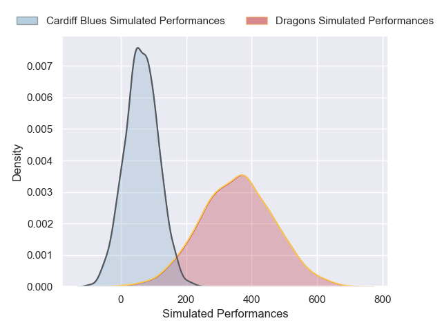
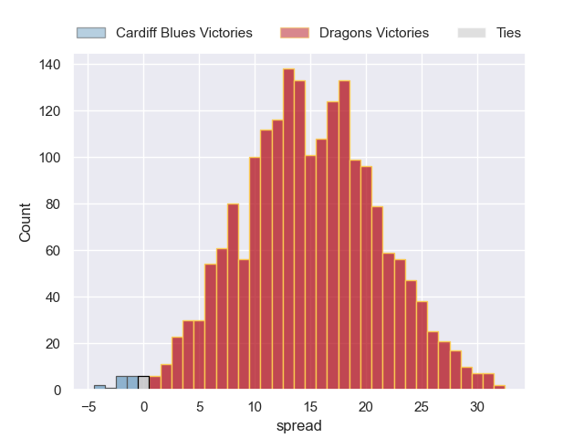

---  
layout: page  
title: Cardiff Blues at Dragons  
date: 2024-12-26 18:00:00 -0500  
categories: "United Rugby Championship 2024" match projection  
---
# Cardiff Blues at Dragons

# Club Level Predictions

The first set of predictions treats a club as the smallest object, as the club develops its members, organizes a gameplan, and deploys its players as needed for each match. This club model has a prediction of 0.259, which translates to predicting Cardiff Blues to win by 6.3.

Our Over/Under is 55.5 - and combined with the spread above, we have a predicted scoreline of 31 to 25

Each club has a rating and a rating deviation (similar to a Glicko rating), and expected performances can be generated. This allows for simulated matches and spreads like the ones below.
## Projected Performances - Club Model

## Projected Spreads - Club Model

## Projected Results - Club Model

# Player Level Predictions

Treating teams instead as an entity made up of the currently active players, I have ratings for each player in an altogether different system. These can be combined to form team ratings once teamsheets are announced, weighting starters a bit higher than the reserves. After the match is played, players can be weighted by their minutes on the field, allowing for an accurate measure of the team's composition. With these compiled team ratings, we can make predictions, measure inaccuracy, and update the individual player ratings.
## Prediction without Player Minutes: Dragons by 15.0

Dragons by 5.0 on a neutral pitch

## Projected Performances - Player Model

## Projected Spreads - Player Model

## Projected Results - Player Model

| Away Player      |   Away Percentile |   Number |   Home Percentile | Home Player        |
|:-----------------|------------------:|---------:|------------------:|:-------------------|
| nan              |            nan    |        1 |             61.57 | Rodrigo Martinez   |
| Dafydd Hughes    |             16.77 |        2 |             62.42 | Brodie Coghlan     |
| nan              |            nan    |        3 |             22.07 | Chris Coleman      |
| nan              |            nan    |        4 |             11.62 | Joseph Davies      |
| nan              |            nan    |        5 |             38.35 | Ryan Woodman       |
| nan              |            nan    |        6 |             45.07 | Dan Lydiate        |
| nan              |            nan    |        7 |             25.51 | Taine Basham       |
| nan              |            nan    |        8 |             19.91 | Aaron Wainwright   |
| nan              |            nan    |        9 |             85.35 | Rhodri Williams    |
| nan              |            nan    |       10 |             10.91 | Angus O'Brien      |
| nan              |            nan    |       11 |             11.43 | Jared Rosser       |
| nan              |            nan    |       12 |             72.78 | Aneurin Owen       |
| nan              |            nan    |       14 |             26.45 | Rio Dyer           |
| Cameron Winnett  |             11.85 |       15 |             44.81 | Huw Anderson       |
| Evan Lloyd       |              9.78 |       16 |             82.76 | Elliot Dee         |
| Danny Southworth |             29.4  |       17 |             35.49 | Aki Seiuli         |
| Rhys Litterick   |             15.49 |       18 |            nan    | Paula Latu         |
| Seb Davies       |             15.35 |       19 |            nan    | Nick Thomas        |
| Alun Lawrence    |             64.33 |       20 |             23.21 | Shane Lewis-Hughes |
| Ellis Bevan      |             31.24 |       21 |             43.8  | Che Hope           |
| Rory Jennings    |             41.07 |       22 |              8.69 | Will Reed          |
| Tom Bowen        |             51.52 |       23 |             13.52 | Cai Evans          |

