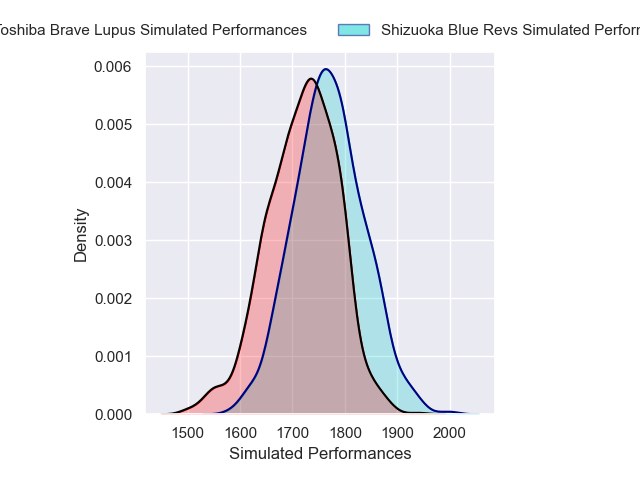
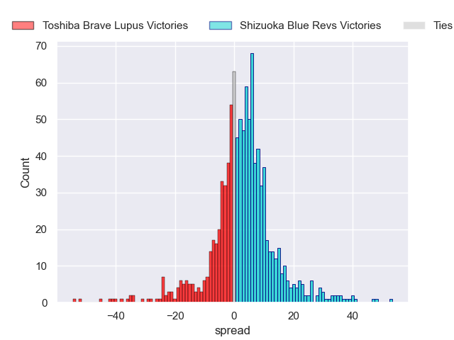
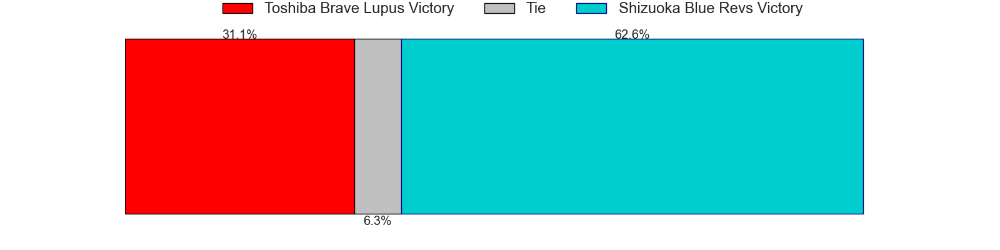

---  
layout: page  
title: Toshiba Brave Lupus at Shizuoka Blue Revs  
date: 2025-01-18 18:00:00 -0500  
categories: "Japan Rugby League One 2024" match projection imputed  
---
# Toshiba Brave Lupus at Shizuoka Blue Revs

# Club Level Predictions

The first set of predictions treats a club as the smallest object, as the club develops its members, organizes a gameplan, and deploys its players as needed for each match. This club model has a prediction of 0.575, which translates to predicting Shizuoka Blue Revs to win by 3.0.

Our Over/Under is 69.5 - and combined with the spread above, we have a predicted scoreline of 33 to 36

Each club has a rating and a rating deviation (similar to a Glicko rating), and expected performances can be generated. This allows for simulated matches and spreads like the ones below.
## Projected Performances - Club Model

## Projected Spreads - Club Model

## Projected Results - Club Model

# Player Level Predictions

Treating teams instead as an entity made up of the currently active players, I have ratings for each player in an altogether different system. These can be combined to form team ratings once teamsheets are announced, weighting starters a bit higher than the reserves. After the match is played, players can be weighted by their minutes on the field, allowing for an accurate measure of the team's composition. With these compiled team ratings, we can make predictions, measure inaccuracy, and update the individual player ratings.
## Prediction with Imputed Lineups: Toshiba Brave Lupus by 1.6

Toshiba Brave Lupus by 5.8 on a neutral pitch

