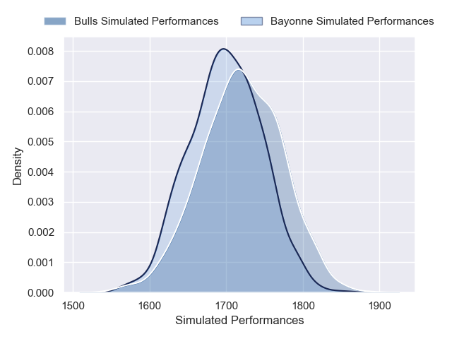
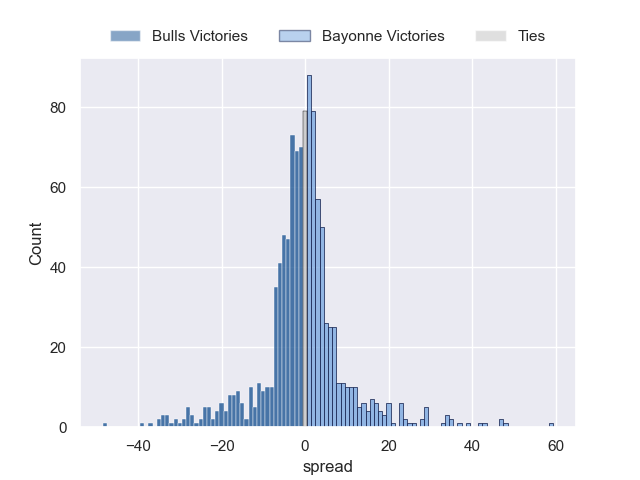

---  
layout: page  
title: Bulls at Bayonne  
date: 2025-04-04 18:00:00 -0500  
categories: "European Rugby Challenge Cup 24/25" match projection imputed  
---
# Bulls at Bayonne

# Club Level Predictions

The first set of predictions treats a club as the smallest object, as the club develops its members, organizes a gameplan, and deploys its players as needed for each match. This club model has a prediction of 0.466, which translates to predicting Bulls to win by 0.7.

Our Over/Under is 55.5 - and combined with the spread above, we have a predicted scoreline of 28 to 28

Each club has a rating and a rating deviation (similar to a Glicko rating), and expected performances can be generated. This allows for simulated matches and spreads like the ones below.
## Projected Performances - Club Model

## Projected Spreads - Club Model

## Projected Results - Club Model

