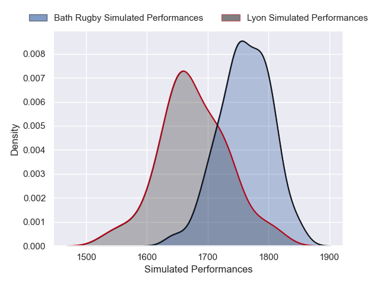
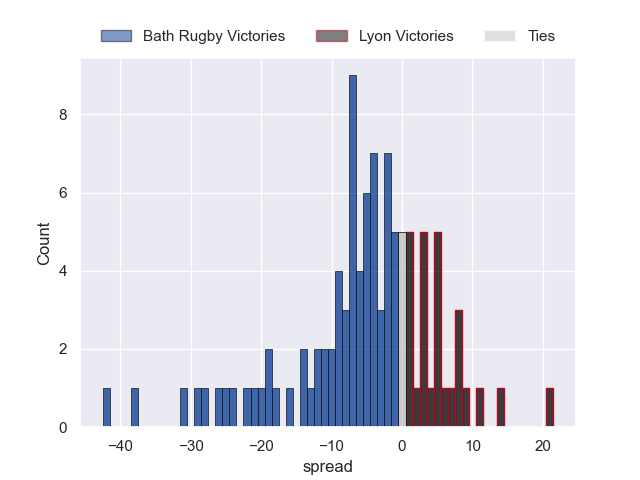

---  
layout: page  
title: Bath Rugby at Lyon  
date: 2025-05-24 18:00:00 -0500  
categories: "European Rugby Challenge Cup 24/25" match projection imputed  
---
# Bath Rugby at Lyon

# Club Level Predictions

The first set of predictions treats a club as the smallest object, as the club develops its members, organizes a gameplan, and deploys its players as needed for each match. This club model has a prediction of 0.359, which translates to predicting Bath Rugby to win by 5.7.

Our Over/Under is 61.5 - and combined with the spread above, we have a predicted scoreline of 34 to 28

Each club has a rating and a rating deviation (similar to a Glicko rating), and expected performances can be generated. This allows for simulated matches and spreads like the ones below.
## Projected Performances - Club Model

## Projected Spreads - Club Model

## Projected Results - Club Model

