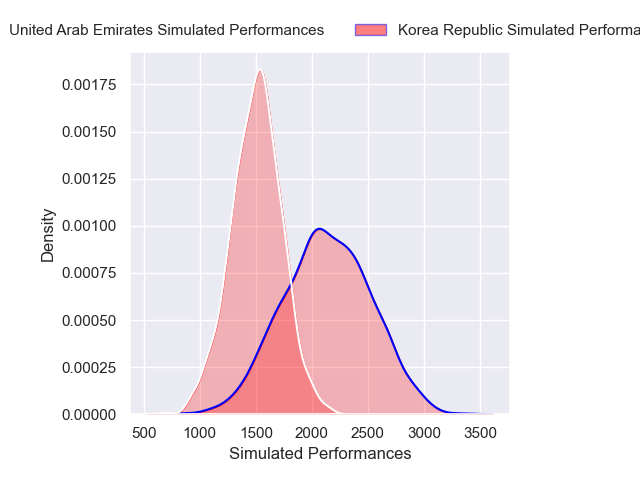
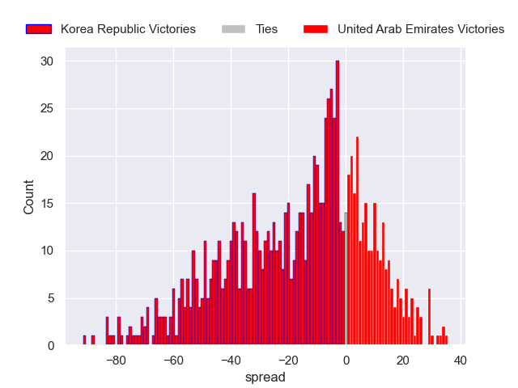
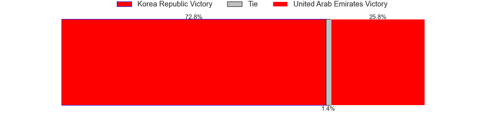

---  
layout: page  
title: Korea Republic V United Arab Emirates on 2025/06/21  
date: 2025-06-20  
categories: "Developmental International 2025" match projection  
---
# Korea Republic V United Arab Emirates on 2025/06/21

# Club Level Predictions

The first set of predictions treats a club as the smallest object, as the club develops its members, organizes a gameplan, and deploys its players as needed for each match. This club model is currently predicting Korea Republic to win by 16.67.

Our Over/Under is 22.5 - and combined with the spread above, we have a predicted scoreline of 20 to 3

Each club has a rating and a rating deviation (similar to a Glicko rating), and expected performances can be generated. This allows for simulated matches and spreads like the ones below.
## Projected Performances - Club Model

## Projected Spreads - Club Model

## Projected Results - Club Model

