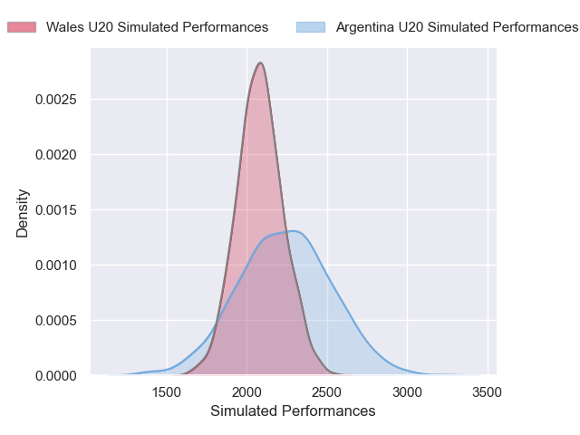
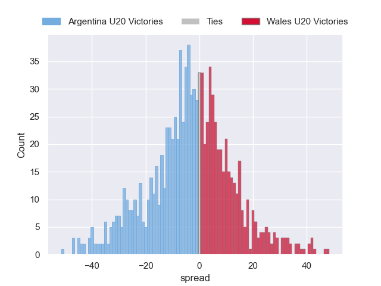

---  
layout: page  
title: Argentina U20 V Wales U20 on 2025/06/29  
date: 2025-06-29  
categories: "U20 Championship 2025" match projection  
---
# Argentina U20 V Wales U20 on 2025/06/29

# Club Level Predictions

The first set of predictions treats a club as the smallest object, as the club develops its members, organizes a gameplan, and deploys its players as needed for each match. This club model is currently predicting Argentina U20 to win by 3.7.

Our Over/Under is 11.5 - and combined with the spread above, we have a predicted scoreline of 8 to 4

Each club has a rating and a rating deviation (similar to a Glicko rating), and expected performances can be generated. This allows for simulated matches and spreads like the ones below.
## Projected Performances - Club Model

## Projected Spreads - Club Model

## Projected Results - Club Model

