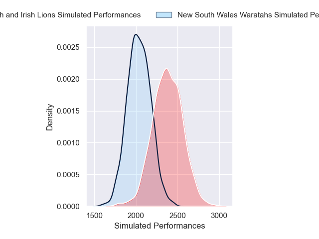
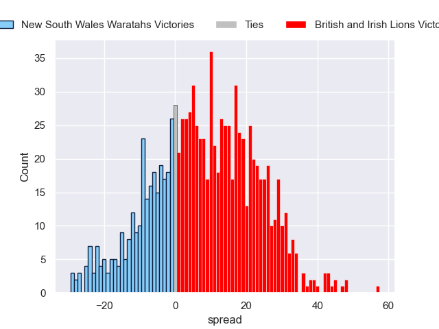

---  
layout: page  
title: New South Wales Waratahs V British and Irish Lions on 2025/07/05  
date: 2025-07-05  
categories: "Lions Tour 2025" match review  
---
# New South Wales Waratahs V British and Irish Lions on 2025/07/05

# Club Level Predictions

The first set of predictions treats a club as the smallest object, as the club develops its members, organizes a gameplan, and deploys its players as needed for each match. This club model is currently predicting British and Irish Lions to win by -8.77.

Our Over/Under is 56.5 - and combined with the spread above, we have a predicted scoreline of 24 to 33

Each club has a rating and a rating deviation (similar to a Glicko rating), and expected performances can be generated. This allows for simulated matches and spreads like the ones below.
## Projected Performances - Club Model

## Projected Spreads - Club Model

## Projected Results - Club Model

