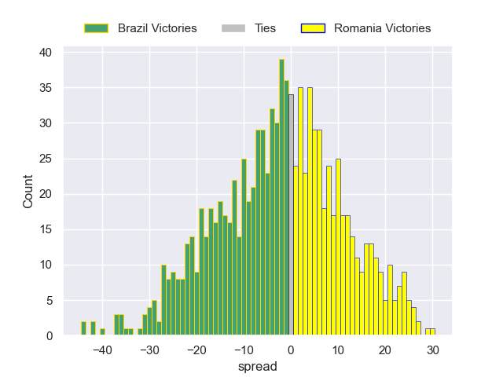

---  
layout: page  
title: Brazil V Romania on 2025/07/11  
date: 2025-07-11  
categories: "Developmental International 2025" match review  
---
# Brazil V Romania on 2025/07/11

# Club Level Predictions

The first set of predictions treats a club as the smallest object, as the club develops its members, organizes a gameplan, and deploys its players as needed for each match. This club model is currently predicting Brazil to win by 3.52.

Our Over/Under is 28.5 - and combined with the spread above, we have a predicted scoreline of 16 to 12

Each club has a rating and a rating deviation (similar to a Glicko rating), and expected performances can be generated. This allows for simulated matches and spreads like the ones below.
## Projected Performances - Club Model

## Projected Spreads - Club Model

## Projected Results - Club Model

