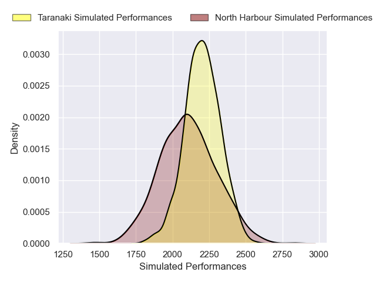
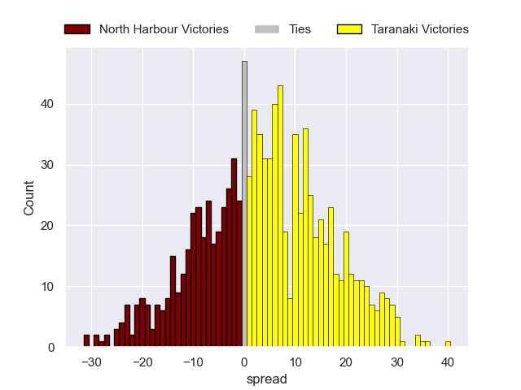

---  
layout: page  
title: North Harbour V Taranaki on 2025/08/08  
date: 2025-08-08  
categories: "NPC 2025" match review  
---
# North Harbour V Taranaki on 2025/08/08

# Club Level Predictions

The first set of predictions treats a club as the smallest object, as the club develops its members, organizes a gameplan, and deploys its players as needed for each match. This club model is currently predicting Taranaki to win by 1.94.

Our Over/Under is 58.5 - and combined with the spread above, we have a predicted scoreline of 28 to 30

Each club has a rating and a rating deviation (similar to a Glicko rating), and expected performances can be generated. This allows for simulated matches and spreads like the ones below.
## Projected Performances - Club Model

## Projected Spreads - Club Model

## Projected Results - Club Model

