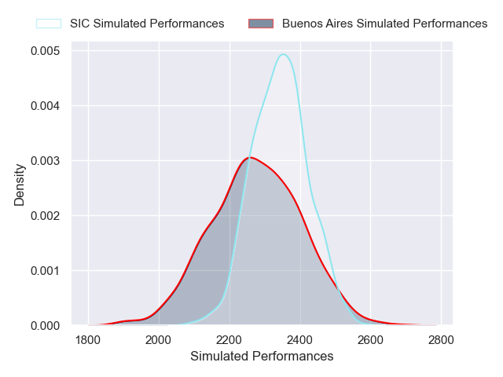
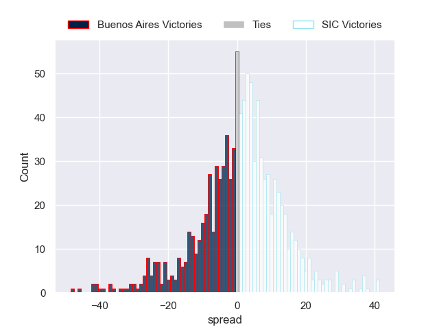

---  
layout: page  
title: Buenos Aires V SIC on 2025/08/09  
date: 2025-08-09  
categories: "URBA Top 12 2025" match projection  
---
# Buenos Aires V SIC on 2025/08/09

# Club Level Predictions

The first set of predictions treats a club as the smallest object, as the club develops its members, organizes a gameplan, and deploys its players as needed for each match. This club model is currently predicting SIC to win by -2.24.

Our Over/Under is 34.5 - and combined with the spread above, we have a predicted scoreline of 16 to 18

Each club has a rating and a rating deviation (similar to a Glicko rating), and expected performances can be generated. This allows for simulated matches and spreads like the ones below.
## Projected Performances - Club Model

## Projected Spreads - Club Model

## Projected Results - Club Model

