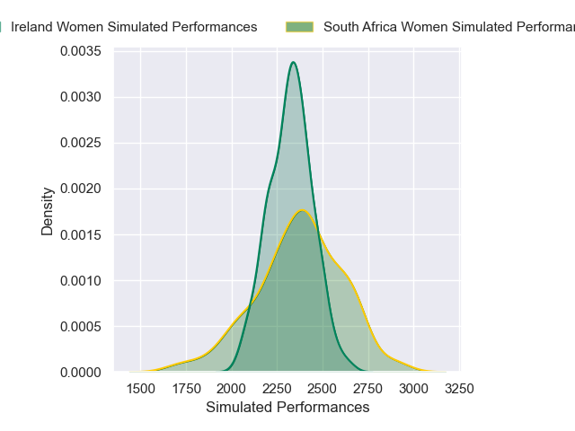
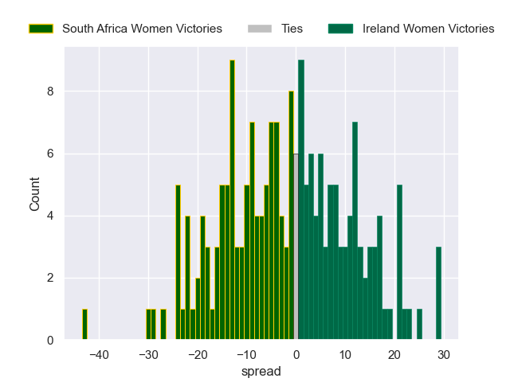

---  
layout: page  
title: South Africa Women V Ireland Women on 2025-09-12  
date: 2025-09-12  
categories: "Women's Rugby World Cup 2025" match review  
---
# South Africa Women V Ireland Women on 2025-09-12

# Club Level Predictions

The first set of predictions treats a club as the smallest object, as the club develops its members, organizes a gameplan, and deploys its players as needed for each match. This club model is currently predicting Ireland Women to win by 0.49.

Our Over/Under is 46.5 - and combined with the spread above, we have a predicted scoreline of 23 to 23

Each club has a rating and a rating deviation (similar to a Glicko rating), and expected performances can be generated. This allows for simulated matches and spreads like the ones below.
## Projected Performances - Club Model

## Projected Spreads - Club Model

## Projected Results - Club Model

