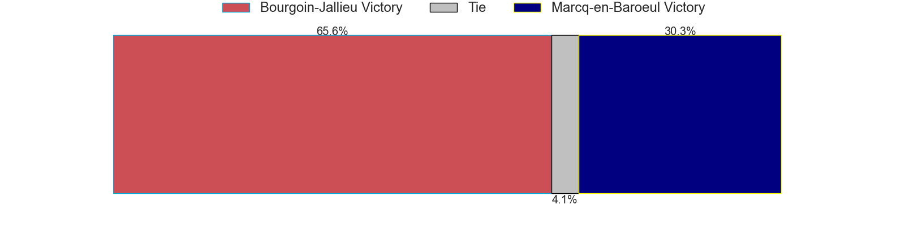

---  
layout: page  
title: Bourgoin-Jallieu V Marcq-en-Baroeul on 2025/11/22  
date: 2025-11-22  
categories: "Nationale 25/26" match review  
---
# Bourgoin-Jallieu V Marcq-en-Baroeul on 2025/11/22

# Club Level Predictions

The first set of predictions treats a club as the smallest object, as the club develops its members, organizes a gameplan, and deploys its players as needed for each match. This club model is currently predicting Bourgoin-Jallieu to win by 3.68.

Our Over/Under is 46.5 - and combined with the spread above, we have a predicted scoreline of 25 to 21

Each club has a rating and a rating deviation (similar to a Glicko rating), and expected performances can be generated. This allows for simulated matches and spreads like the ones below.
## Projected Performances - Club Model

## Projected Spreads - Club Model

## Projected Results - Club Model

