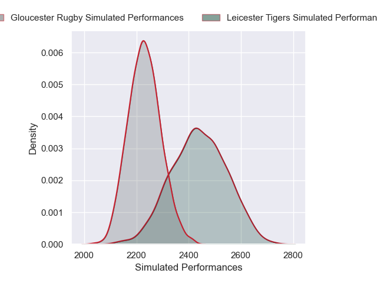
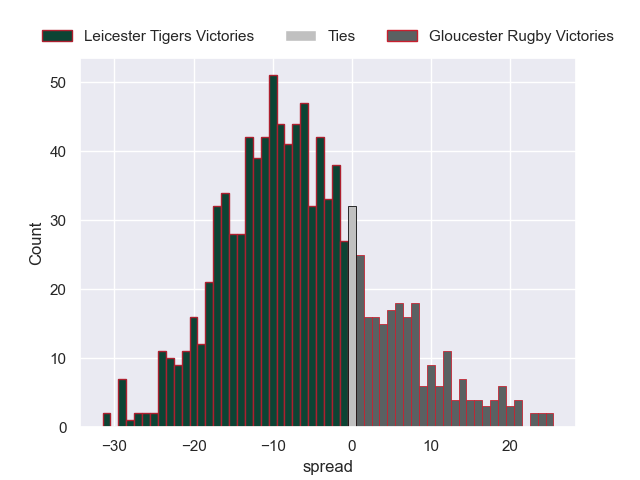

---  
layout: page  
title: Leicester Tigers V Gloucester Rugby on 2025/12/19  
date: 2025-12-19  
categories: "Gallagher Premiership 25/26" match review  
---
# Leicester Tigers V Gloucester Rugby on 2025/12/19

# Club Level Predictions

The first set of predictions treats a club as the smallest object, as the club develops its members, organizes a gameplan, and deploys its players as needed for each match. This club model is currently predicting Leicester Tigers to win by 5.59.

Our Over/Under is 54.5 - and combined with the spread above, we have a predicted scoreline of 30 to 24

Each club has a rating and a rating deviation (similar to a Glicko rating), and expected performances can be generated. This allows for simulated matches and spreads like the ones below.
## Projected Performances - Club Model

## Projected Spreads - Club Model

## Projected Results - Club Model

