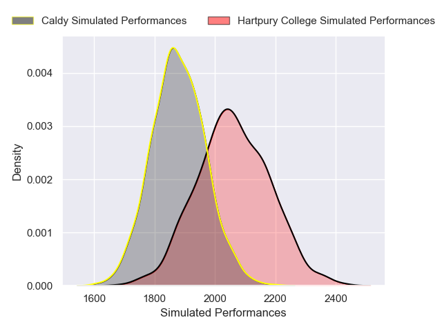

---  
layout: page  
title: Hartpury College RFC V Caldy on 2025/12/20  
date: 2025-12-20  
categories: "RFU Championship 25/26" match review  
---
# Hartpury College RFC V Caldy on 2025/12/20

# Club Level Predictions

The first set of predictions treats a club as the smallest object, as the club develops its members, organizes a gameplan, and deploys its players as needed for each match. This club model is currently predicting Hartpury College to win by 5.82.

Our Over/Under is 51.5 - and combined with the spread above, we have a predicted scoreline of 29 to 23

Each club has a rating and a rating deviation (similar to a Glicko rating), and expected performances can be generated. This allows for simulated matches and spreads like the ones below.
## Projected Performances - Club Model

## Projected Spreads - Club Model

## Projected Results - Club Model

