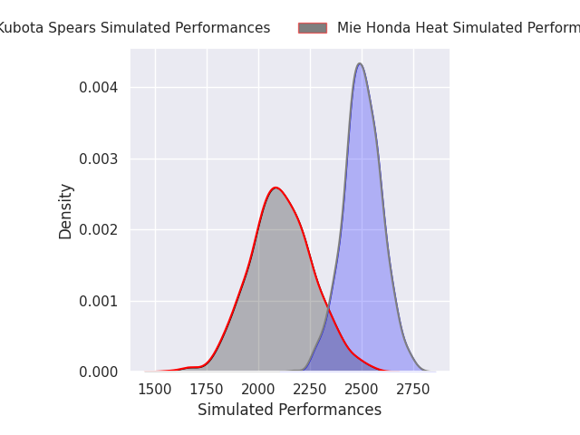
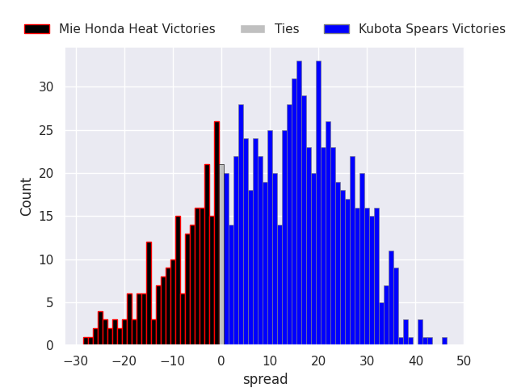
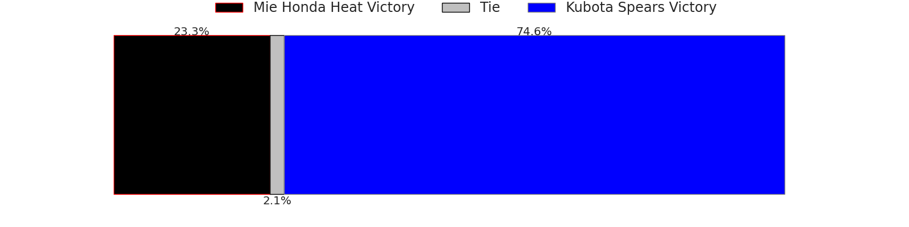

# Mie Honda Heat V Kubota Spears on 2026/01/10

# Club Level Predictions

The first set of predictions treats a club as the smallest object, as the club develops its members, organizes a gameplan, and deploys its players as needed for each match. This club model is currently predicting Kubota Spears to win by 10.74.

Our Over/Under is 71.5 - and combined with the spread above, we have a predicted scoreline of 30 to 41

Each club has a rating and a rating deviation (similar to a Glicko rating), and expected performances can be generated. This allows for simulated matches and spreads like the ones below.
## Projected Performances - Club Model

## Projected Spreads - Club Model

## Projected Results - Club Model

