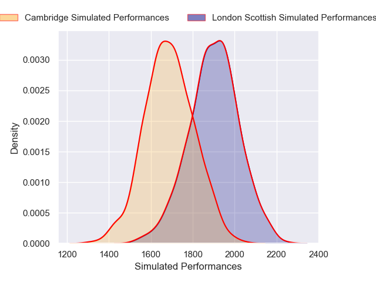

---  
layout: page  
title: London Scottish V Cambridge on 2026/01/31  
date: 2026-01-31  
categories: "RFU Championship 25/26" match review  
---
# London Scottish V Cambridge on 2026/01/31

# Club Level Predictions

The first set of predictions treats a club as the smallest object, as the club develops its members, organizes a gameplan, and deploys its players as needed for each match. This club model is currently predicting London Scottish to win by 6.3.

Our Over/Under is 63.5 - and combined with the spread above, we have a predicted scoreline of 35 to 29

Each club has a rating and a rating deviation (similar to a Glicko rating), and expected performances can be generated. This allows for simulated matches and spreads like the ones below.
## Projected Performances - Club Model

## Projected Spreads - Club Model

## Projected Results - Club Model

