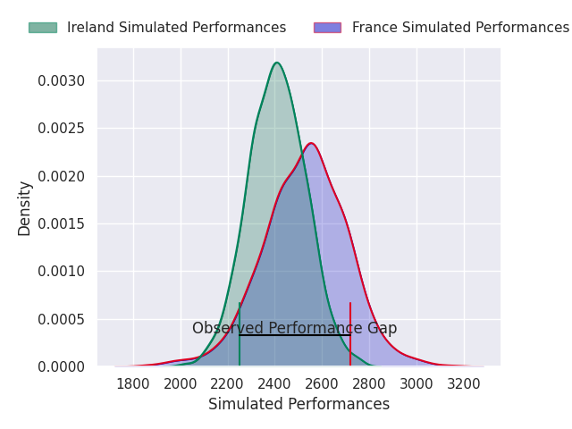
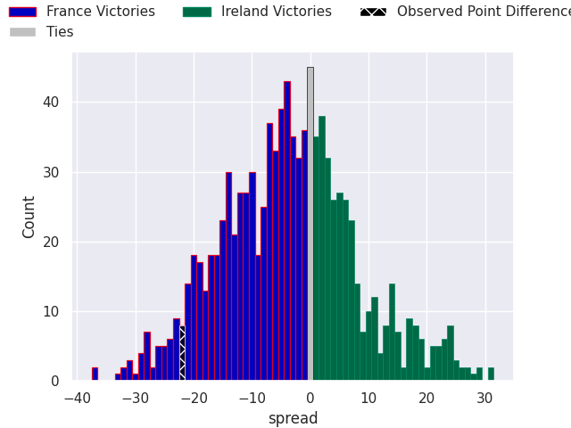
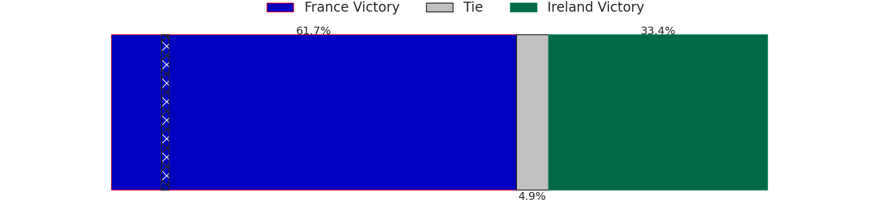
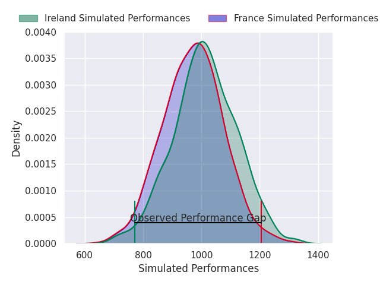
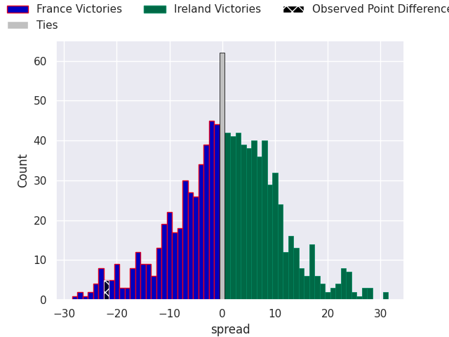

# France V Ireland on 2026/02/05

# Club Level Predictions

The first set of predictions treats a club as the smallest object, as the club develops its members, organizes a gameplan, and deploys its players as needed for each match. This club model is currently predicting France to win by 3.02.

Our Over/Under is 46.5 - and combined with the spread above, we have a predicted scoreline of 25 to 22

Each club has a rating and a rating deviation (similar to a Glicko rating), and expected performances can be generated. This allows for simulated matches and spreads like the ones below.
## Projected Performances - Club Model

## Projected Spreads - Club Model

## Projected Results - Club Model

# Player Level Predictions

The second set of predictions is based around the players themselves - each player gets a rating, and their contribution is weighted by their time on the field. The player model is currently predicting France to win by 0.5
## Projected Performances - Player Model

## Projected Spreads - Player Model

## Projected Results - Player Model

