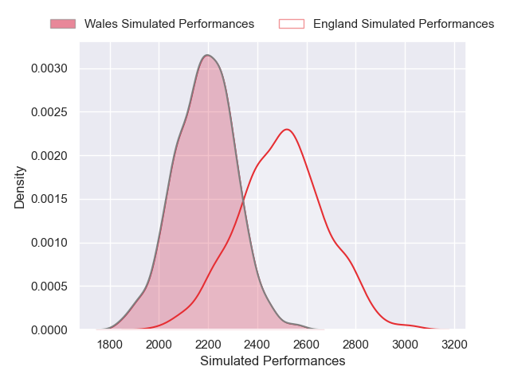
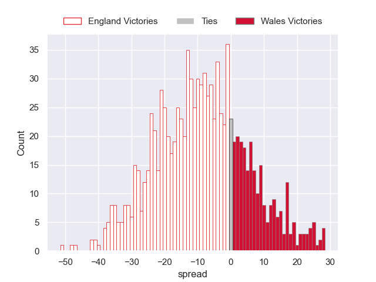

---  
layout: page  
title: England V Wales on 2026/02/07  
date: 2026-02-07  
categories: "Six Nations 2026" match review  
---
# England V Wales on 2026/02/07

# Club Level Predictions

The first set of predictions treats a club as the smallest object, as the club develops its members, organizes a gameplan, and deploys its players as needed for each match. This club model is currently predicting England to win by 9.38.

Our Over/Under is 51.5 - and combined with the spread above, we have a predicted scoreline of 30 to 21

Each club has a rating and a rating deviation (similar to a Glicko rating), and expected performances can be generated. This allows for simulated matches and spreads like the ones below.
## Projected Performances - Club Model

## Projected Spreads - Club Model

## Projected Results - Club Model

