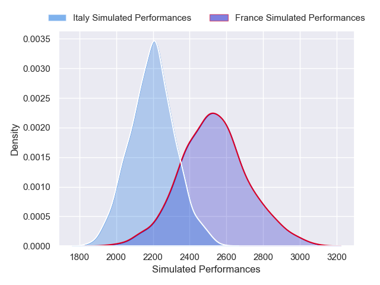
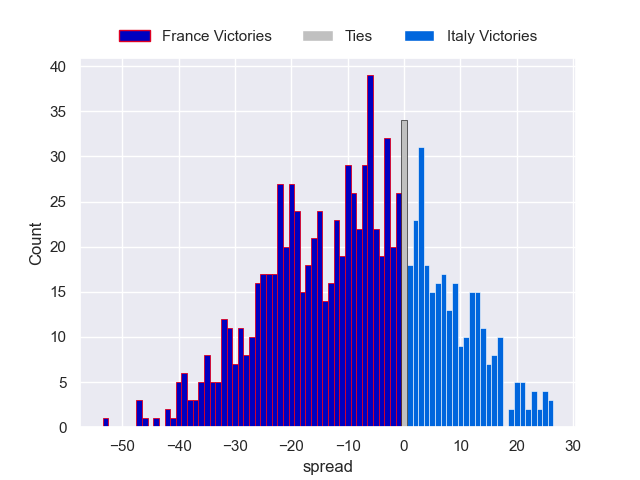
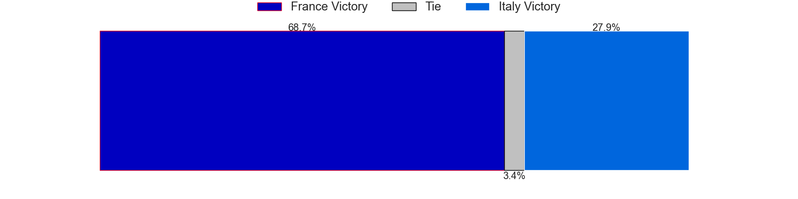

---  
layout: page  
title: France V Italy on 2026/02/22  
date: 2026-02-22  
categories: "Six Nations 2026" match review  
---
# France V Italy on 2026/02/22

# Club Level Predictions

The first set of predictions treats a club as the smallest object, as the club develops its members, organizes a gameplan, and deploys its players as needed for each match. This club model is currently predicting France to win by 9.15.

Our Over/Under is 59.5 - and combined with the spread above, we have a predicted scoreline of 34 to 25

Each club has a rating and a rating deviation (similar to a Glicko rating), and expected performances can be generated. This allows for simulated matches and spreads like the ones below.
## Projected Performances - Club Model

## Projected Spreads - Club Model

## Projected Results - Club Model

