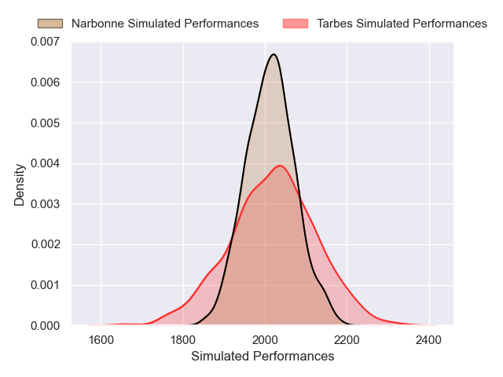
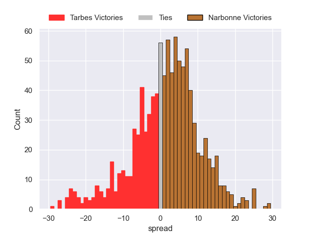

---  
layout: page  
title: Tarbes V Narbonne on 2026/02/27  
date: 2026-02-27  
categories: "Nationale 25/26" match review  
---
# Tarbes V Narbonne on 2026/02/27

# Club Level Predictions

The first set of predictions treats a club as the smallest object, as the club develops its members, organizes a gameplan, and deploys its players as needed for each match. This club model is currently predicting Tarbes to win by 1.17.

Our Over/Under is 47.5 - and combined with the spread above, we have a predicted scoreline of 24 to 23

Each club has a rating and a rating deviation (similar to a Glicko rating), and expected performances can be generated. This allows for simulated matches and spreads like the ones below.
## Projected Performances - Club Model

## Projected Spreads - Club Model

## Projected Results - Club Model

