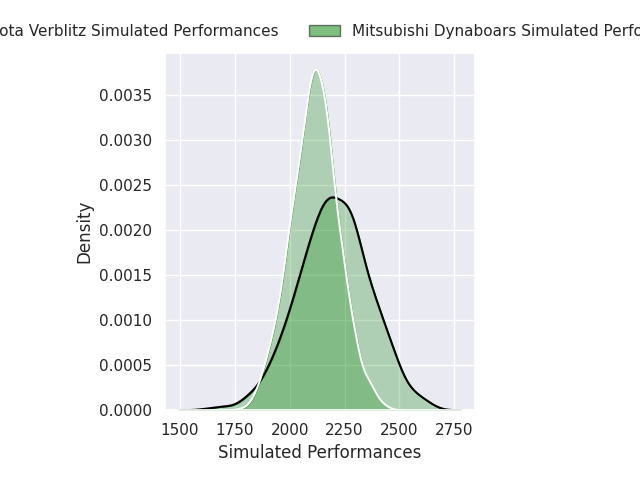
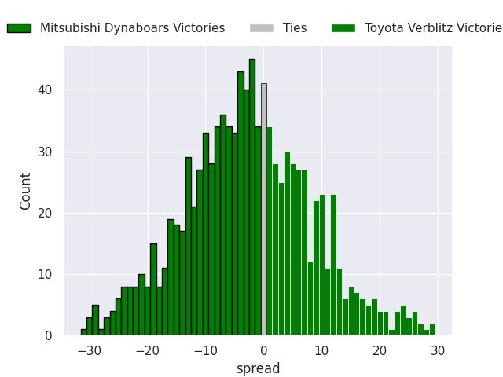

# Mitsubishi Dynaboars V Toyota Verblitz on 2026/03/01

# Club Level Predictions

The first set of predictions treats a club as the smallest object, as the club develops its members, organizes a gameplan, and deploys its players as needed for each match. This club model is currently predicting Mitsubishi Dynaboars to win by 2.71.

Our Over/Under is 59.5 - and combined with the spread above, we have a predicted scoreline of 31 to 28

Each club has a rating and a rating deviation (similar to a Glicko rating), and expected performances can be generated. This allows for simulated matches and spreads like the ones below.
## Projected Performances - Club Model

## Projected Spreads - Club Model

## Projected Results - Club Model

