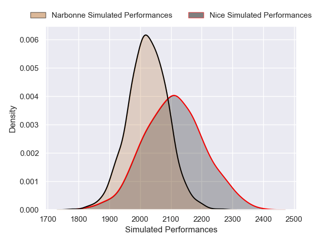
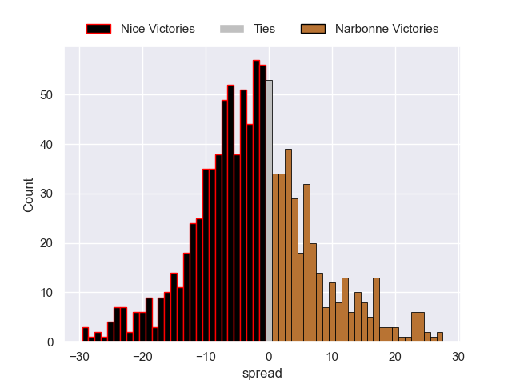

---  
layout: page  
title: Nice V Narbonne on 2026/03/28  
date: 2026-03-28  
categories: "Nationale 25/26" match review  
---
# Nice V Narbonne on 2026/03/28

# Club Level Predictions

The first set of predictions treats a club as the smallest object, as the club develops its members, organizes a gameplan, and deploys its players as needed for each match. This club model is currently predicting Nice to win by 1.7.

Our Over/Under is 43.5 - and combined with the spread above, we have a predicted scoreline of 23 to 21

Each club has a rating and a rating deviation (similar to a Glicko rating), and expected performances can be generated. This allows for simulated matches and spreads like the ones below.
## Projected Performances - Club Model

## Projected Spreads - Club Model

## Projected Results - Club Model

