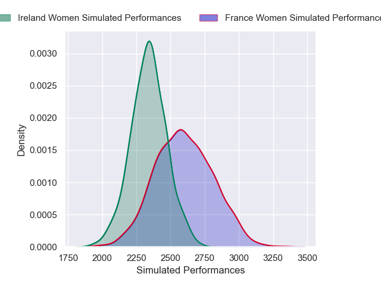

---  
layout: page  
title: France Women V Ireland Women on 2026/04/25  
date: 2026-04-25  
categories: "Women's Six Nations 2026" match review  
---
# France Women V Ireland Women on 2026/04/25

# Club Level Predictions

The first set of predictions treats a club as the smallest object, as the club develops its members, organizes a gameplan, and deploys its players as needed for each match. This club model is currently predicting France Women to win by 7.14.

Our Over/Under is 49.5 - and combined with the spread above, we have a predicted scoreline of 28 to 21

Each club has a rating and a rating deviation (similar to a Glicko rating), and expected performances can be generated. This allows for simulated matches and spreads like the ones below.
## Projected Performances - Club Model

## Projected Spreads - Club Model

## Projected Results - Club Model

