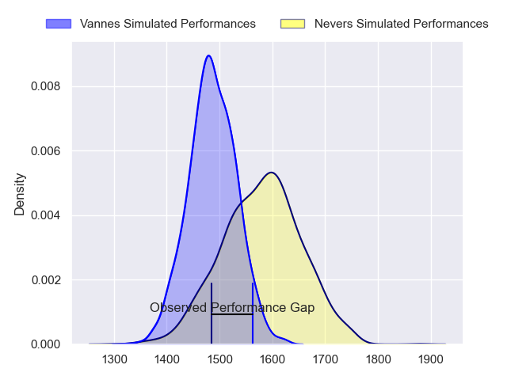
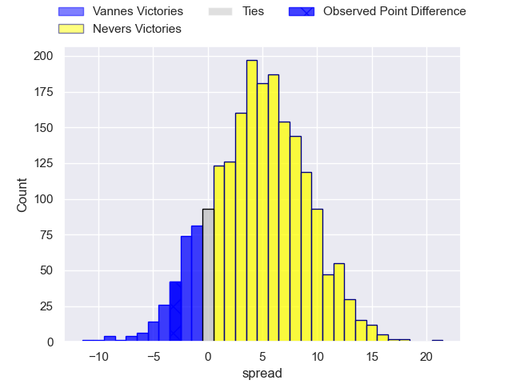
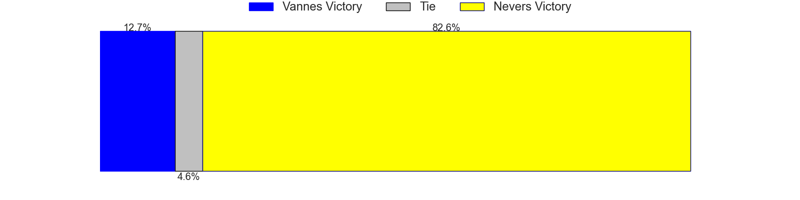

---  
layout: page  
title: Vannes at Nevers; 20-17  
date: 2023-05-11 21:00:00 18:00:00 -0500  
categories: match review  
---
# Vannes at Nevers; 20-17

# Club Level Predictions

The first set of predictions treats a club as the smallest object, as the club develops its members, organizes a gameplan, and deploys its players as needed for each match. This club model has a prediction of 0.633, which translates to predicting Nevers to win by 4.8.

Each club has a rating and a rating deviation (simiar to a Glicko system), and expected performances can be generated. This allows for simulated matches and spreads like the ones below.
## Projected Performances

## Projected Spreads

## Projected Results

# Player Level Predictions

Treating teams instead as an entity made up of the currently active players, I have ratings for each player in an altogether different system. These can be combined to form team ratings once teamsheets are announced, weighting starters a bit higher than the reserves. After the match is played, players can be weighted by their minutes on the field, allowing for an accurate measure of the team's composition. With these compiled team ratings, we can make predictions, measure inaccuracy, and update the individual player ratings.
## Prediction with Player Minutes: Nevers by 11.3

Nevers by 7.3 on a neutral field

There were 13 large changes in win probability in this match
## Prediction without Player Minutes: Nevers by 12.3

Nevers by 8.3 on a neutral pitch

|   Away Minutes | Away Player           |   Away elo |   Away Percentile |   Number |   Home Percentile |   Home elo | Home Player         |   Home Minutes |
|---------------:|:----------------------|-----------:|------------------:|---------:|------------------:|-----------:|:--------------------|---------------:|
|             58 | Andy Bordelai         |     103.88 |                91 |        1 |                59 |      80.93 | Kamaliele Tufele    |             51 |
|             52 | Cyril Blanchard       |      82.03 |                58 |        2 |                86 |      97.84 | Elia Elia           |             41 |
|             52 | John Afoa             |      81.04 |                60 |        3 |                34 |      70.09 | Cleopas Kundiona    |             47 |
|             59 | Éric Marks            |      87.31 |                71 |        4 |                95 |     113.42 | Maxence Barjaud     |             80 |
|             80 | Ewan Thomas Johnson   |      94.93 |                78 |        5 |                54 |      78.5  | Maka Polutele       |             58 |
|             55 | Léon Boulier          |      91.43 |                78 |        6 |                61 |      82.16 | Luka Plataret       |             58 |
|             80 | Francisco Gorrisen    |      87.29 |                72 |        7 |                95 |     116.04 | Hugues Bastide      |             60 |
|             80 | Myles Edwards         |      65.59 |                27 |        8 |                16 |      60.07 | Steven David        |             80 |
|             80 | Michael Ruru          |      92.71 |                77 |        9 |                81 |      95.62 | Yoan Cottin         |             80 |
|             80 | Maxime Lafage         |      80.33 |                50 |       10 |                67 |      88.33 | Yohan Le Bourhis    |             80 |
|             80 | Romaric Camou         |      73.34 |                43 |       11 |                61 |      81.83 | Lucas Blanc         |             80 |
|             80 | Andres Vilaseca       |     100.2  |                84 |       12 |                67 |      90.32 | Mattéo Faucher      |             76 |
|             44 | Sacha Valleau         |      84.5  |                62 |       13 |                95 |     115.36 | Alifereti Loaloa    |             80 |
|             80 | Nathanael Hulleu      |      77.26 |                46 |       14 |                63 |      83.1  | Christian Ambadiang |             80 |
|             80 | Gwenaël Duplenne      |      93.64 |                75 |       15 |                82 |     100.32 | Kylian Jaminet      |             80 |
|             36 | Théo Bastardie        |      94.26 |                81 |       16 |                53 |      83.16 | Issam Hamel         |             39 |
|             28 | Théo Beziat           |      99.6  |                88 |       17 |                75 |      89.14 | Ilia Kaikatsishvili |             33 |
|             28 | Phil Kite             |      76.39 |                43 |       18 |                66 |      83.7  | Aitor Kitutu        |             29 |
|             25 | Karl Chateau          |      86.81 |                71 |       19 |                88 |     105.02 | Senio Toleafoa      |             22 |
|             22 | Charles-Henri Berguet |      57.46 |                12 |       20 |                78 |      93.07 | Jason-Collin Fraser |             22 |
|             21 | Edoardo Iachizzi      |      81.42 |                60 |       21 |                85 |     100.84 | Kevin Noah          |             20 |
|            nan | nan                   |     nan    |               nan |       22 |                47 |      77.64 | Thomas Zenon        |              4 |

