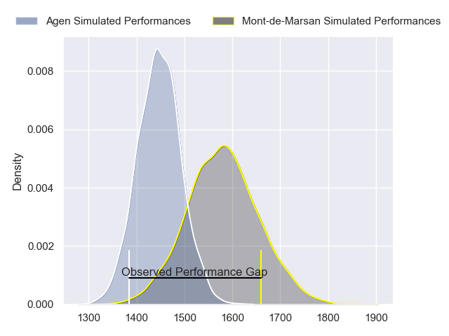
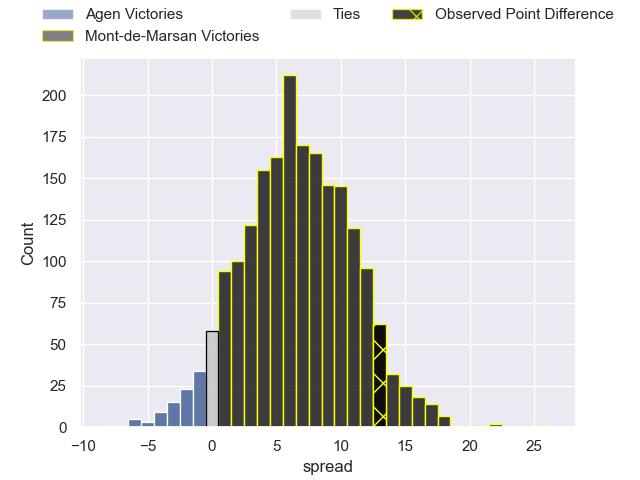
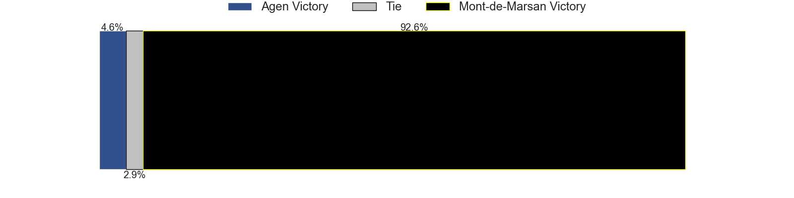

---  
layout: page  
title: Agen at Mont-de-Marsan; 24-37  
date: 2023-05-12 21:00:00 18:00:00 -0500  
categories: match review  
---
# Agen at Mont-de-Marsan; 24-37

# Club Level Predictions

The first set of predictions treats a club as the smallest object, as the club develops its members, organizes a gameplan, and deploys its players as needed for each match. This club model has a prediction of 0.678, which translates to predicting Mont-de-Marsan to win by 6.5.

Each club has a rating and a rating deviation (simiar to a Glicko system), and expected performances can be generated. This allows for simulated matches and spreads like the ones below.
## Projected Performances

## Projected Spreads

## Projected Results

# Player Level Predictions

Treating teams instead as an entity made up of the currently active players, I have ratings for each player in an altogether different system. These can be combined to form team ratings once teamsheets are announced, weighting starters a bit higher than the reserves. After the match is played, players can be weighted by their minutes on the field, allowing for an accurate measure of the team's composition. With these compiled team ratings, we can make predictions, measure inaccuracy, and update the individual player ratings.
## Prediction with Player Minutes: Mont-de-Marsan by 25.8

Mont-de-Marsan by 21.8 on a neutral field

There were 3 large changes in win probability in this match
## Prediction without Player Minutes: Mont-de-Marsan by 27.9

Mont-de-Marsan by 23.9 on a neutral pitch

|   Away Minutes | Away Player           |   Away elo |   Away Percentile |   Number |   Home Percentile |   Home elo | Home Player               |   Home Minutes |
|---------------:|:----------------------|-----------:|------------------:|---------:|------------------:|-----------:|:--------------------------|---------------:|
|             45 | Florent Guion         |      42.11 |                 2 |        1 |                70 |      86.33 | Jean-Luc Innocente        |             22 |
|             45 | Clément Martinez      |      68.68 |                37 |        2 |                81 |      93.53 | Jose Luis Gonzalez        |             65 |
|             62 | Alex Burin            |      87.37 |                73 |        3 |                24 |      65.06 | Anthony Alves             |             65 |
|             48 | Antoine Erbani        |      72.35 |                40 |        4 |                62 |      82.34 | Nicolas Garrault          |             80 |
|             80 | William Demotte       |      76.31 |                49 |        5 |                89 |     101.46 | Romain Durand             |             80 |
|             62 | Arnaud Duputs         |      84.19 |                65 |        6 |                77 |      93.4  | Yann Brethous             |             62 |
|             80 | Vincent Farré         |      78.87 |                54 |        7 |                85 |      98.13 | Veresa Tuqovu Ramototabua |             80 |
|             51 | Martin Devergie       |      71.2  |                34 |        8 |                68 |      85.73 | Michael Faleafa           |             52 |
|             65 | Sonatane Takulua      |      73.83 |                43 |        9 |                49 |      76.58 | Christophe Loustalot      |             65 |
|             65 | Elton Thomas Jantjies |      76.07 |                48 |       10 |                77 |      93.15 | Willie du Plessis         |             80 |
|             80 | Jefferson Joseph      |      75.46 |                48 |       11 |                84 |      98.05 | Kaminieli Rasaku          |             80 |
|             80 | Kolinio Ramoka        |      87.01 |                67 |       12 |                91 |     109    | Jules Even                |             65 |
|             80 | Clément Garrigues     |      80.52 |                62 |       13 |                94 |     112.91 | Nacani Wakaya             |             80 |
|             80 | Loris Tolot           |      76.07 |                64 |       14 |                85 |      98.02 | Wame Naituvi              |             80 |
|             80 | Jean-Marcellin Buttin |      80.84 |                53 |       15 |                85 |     103.24 | Yoann Laousse Azpiazu     |             65 |
|             35 | Hans Lombard-Buret    |      84.87 |                68 |       16 |                27 |      71.23 | Max Curie                 |             58 |
|             35 | Loris Zarantonello    |      78.48 |                55 |       17 |                84 |      97.05 | Aurélien Lisena           |             28 |
|             32 | Corentin Vernet       |      85.6  |                70 |       18 |               nan |      86.74 | Leandro Luis Cedaro       |             18 |
|             29 | Matthieu Bonnet       |     110.9  |                94 |       19 |                64 |      85.07 | Lucas Mensa               |             15 |
|             18 | Zak Farrance          |      65.58 |                27 |       20 |                46 |      77.5  | Alexandre de Nardi        |             15 |
|             18 | Walter Desmaison      |      62.03 |                19 |       21 |                67 |      84.93 | Gheorge Gajion            |             15 |
|             15 | Emile Dayral          |      82.62 |                63 |       22 |               nan |      79.25 | Clément Darbo             |             15 |
|             15 | Theo Idjellidaine     |      66.88 |                42 |       23 |                58 |      83.34 | Simon Labouyrie           |             15 |

