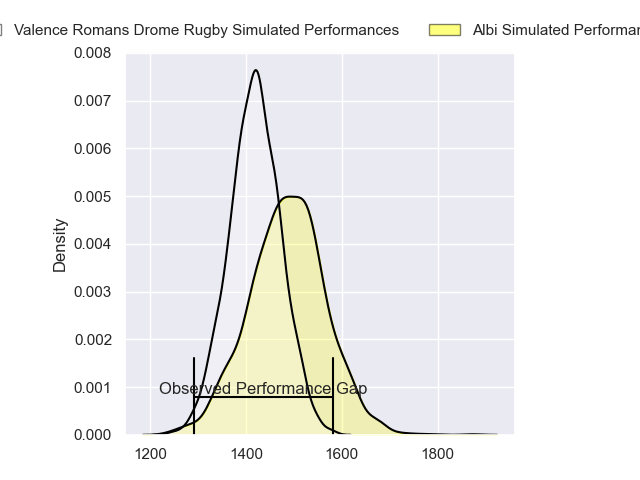
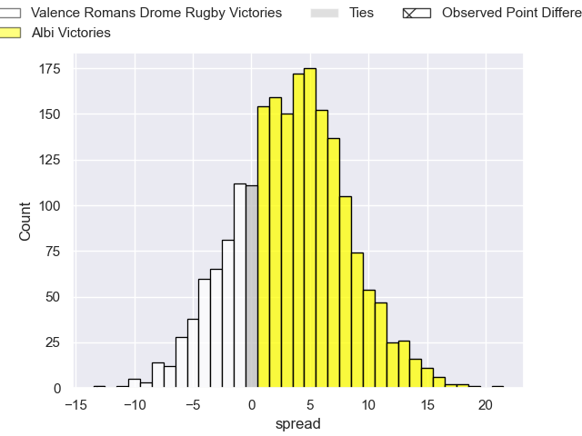
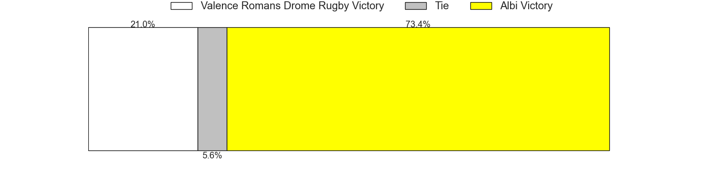

---  
layout: page  
title: Valence Romans Drome Rugby at Albi; 20-7  
date: 2023-05-13 18:00:00 18:00:00 -0500  
categories: match review  
---
# Valence Romans Drome Rugby at Albi; 20-7

# Club Level Predictions

The first set of predictions treats a club as the smallest object, as the club develops its members, organizes a gameplan, and deploys its players as needed for each match. This club model has a prediction of 0.596, which translates to predicting Albi to win by 3.4.

Each club has a rating and a rating deviation (simiar to a Glicko system), and expected performances can be generated. This allows for simulated matches and spreads like the ones below.
## Projected Performances

## Projected Spreads

## Projected Results

# Player Level Predictions

Treating teams instead as an entity made up of the currently active players, I have ratings for each player in an altogether different system. These can be combined to form team ratings once teamsheets are announced, weighting starters a bit higher than the reserves. After the match is played, players can be weighted by their minutes on the field, allowing for an accurate measure of the team's composition. With these compiled team ratings, we can make predictions, measure inaccuracy, and update the individual player ratings.
## Prediction with Player Minutes: Valence Romans Drome Rugby by 9.2

Valence Romans Drome Rugby by 13.2 on a neutral field

There were 1 large changes in win probability in this match
## Prediction without Player Minutes: Valence Romans Drome Rugby by 6.8

Valence Romans Drome Rugby by 10.8 on a neutral pitch

|   Away Minutes | Away Player                   |   Away elo |   Away Percentile |   Number |   Home Percentile |   Home elo | Home Player                 |   Home Minutes |
|---------------:|:------------------------------|-----------:|------------------:|---------:|------------------:|-----------:|:----------------------------|---------------:|
|             61 | Sami Zouhair                  |      73.28 |                41 |        1 |                65 |      81.69 | Antoine Soave               |             47 |
|             65 | Dorian Marco Pena             |     106.29 |                93 |        2 |                67 |      84.08 | Reinach Venter              |             47 |
|             61 | John Henry Fincham            |      84.39 |                73 |        3 |                33 |      69.59 | Dimitri Tchapnga            |             47 |
|             80 | Darrell Dyer                  |     116.31 |                96 |        4 |                32 |      68.89 | Pierre Roussel              |             80 |
|             80 | John Adriaan (Ian) Groenewald |      71.25 |                37 |        5 |                23 |      63.89 | Jacques Jacobus Engelbrecht |             61 |
|             66 | Alexis Armary                 |     100.69 |                87 |        6 |                42 |      73.39 | Vincent Calas               |             80 |
|             56 | Sven Bernat Girlando          |      94.71 |                81 |        7 |                84 |      96.52 | Lucas Guillaume             |             80 |
|             71 | Ioane Iashagashvili           |      82.23 |                67 |        8 |                37 |      71.35 | Camille Jarreau             |             47 |
|             80 | Tim Menzel                    |      49.33 |                 7 |        9 |                12 |      56.18 | Théo Vidal                  |             47 |
|             80 | Joris Moura                   |     104.7  |                88 |       10 |                76 |      92.19 | Benjamin Pehau              |             80 |
|             61 | Adam Vargas                   |      88.44 |                74 |       11 |                29 |      66.25 | Luca Sperandio              |             80 |
|             80 | Ben Neiceru                   |     108.51 |                92 |       12 |                99 |     134.88 | Baptiste Couchinave         |             47 |
|             80 | Charles Bouldoire             |      73.17 |                48 |       13 |                20 |      62.22 | James Haydn Tedder          |             80 |
|             80 | Mason Emerson                 |      77.92 |                54 |       14 |                45 |      73.93 | Charly Vicenzo Trussardi    |             80 |
|             80 | Quentin Gobet                 |      83.18 |                57 |       15 |                46 |      77.41 | Enzo Marzocca               |             56 |
|             19 | Anthony Aléo                  |      90.05 |                78 |       16 |                84 |      93.74 | Maxime Escur                |             33 |
|             15 | Yanis Gimenez                 |      87.8  |                74 |       17 |                38 |      68.53 | Arthur Castant              |             33 |
|             19 | Kevin Goze                    |      74.46 |                44 |       18 |                48 |      75    | Jean-Baptiste De Clercq     |             33 |
|             14 | Charles Brayer                |      75.88 |                63 |       19 |                 2 |      36.9  | Mohsen Essid                |             19 |
|              9 | Dylan Hayes                   |      79.3  |               nan |       20 |                71 |      87.02 | Luke Joseph Stringer        |             33 |
|             24 | Matthew Gicquel               |      47.03 |                 5 |       21 |                68 |      85.47 | Titouan Pouzoullic          |             33 |
|             19 | Lucas Méret                   |      63.22 |                22 |       22 |                20 |      62.16 | Simon Andreu                |             33 |
|            nan | nan                           |     nan    |               nan |       23 |                51 |      78.4  | Paul Clergue                |             24 |

