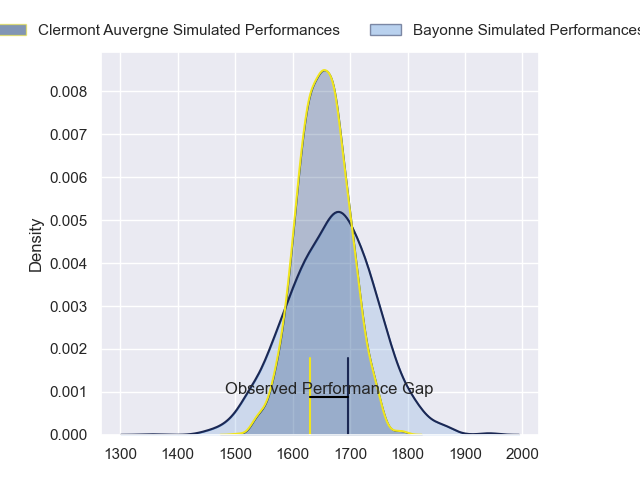
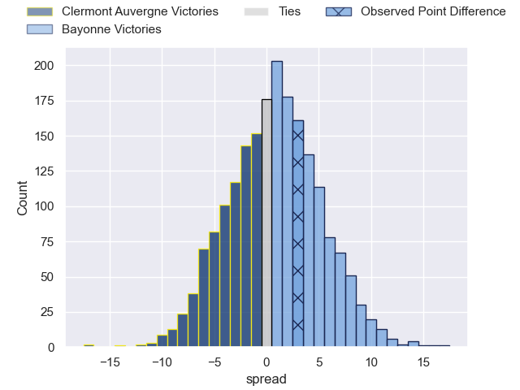
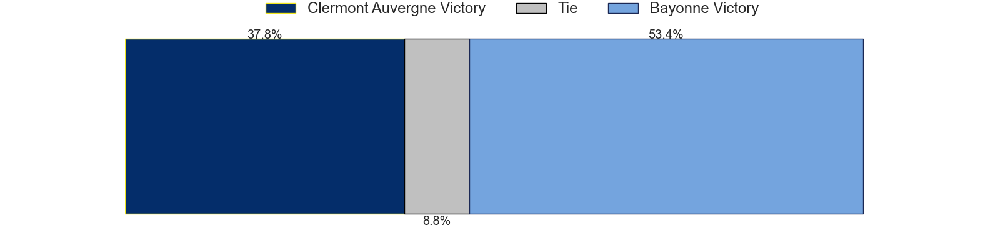

---  
layout: page  
title: Clermont Auvergne at Bayonne; 18-21  
date: 2023-05-13 17:00:00 18:00:00 -0500  
categories: match review  
---
# Clermont Auvergne at Bayonne; 18-21

# Club Level Predictions

The first set of predictions treats a club as the smallest object, as the club develops its members, organizes a gameplan, and deploys its players as needed for each match. This club model has a prediction of 0.519, which translates to predicting Bayonne to win by 0.7.

Each club has a rating and a rating deviation (simiar to a Glicko system), and expected performances can be generated. This allows for simulated matches and spreads like the ones below.
## Projected Performances

## Projected Spreads

## Projected Results

# Player Level Predictions

Treating teams instead as an entity made up of the currently active players, I have ratings for each player in an altogether different system. These can be combined to form team ratings once teamsheets are announced, weighting starters a bit higher than the reserves. After the match is played, players can be weighted by their minutes on the field, allowing for an accurate measure of the team's composition. With these compiled team ratings, we can make predictions, measure inaccuracy, and update the individual player ratings.
## Prediction with Player Minutes: Clermont Auvergne by 9.1

Clermont Auvergne by 13.1 on a neutral field

There were 9 large changes in win probability in this match
## Prediction without Player Minutes: Clermont Auvergne by 10.8

Clermont Auvergne by 14.8 on a neutral pitch

|   Away Minutes | Away Player                |   Away elo |   Away Percentile |   Number |   Home Percentile |   Home elo | Home Player           |   Home Minutes |
|---------------:|:---------------------------|-----------:|------------------:|---------:|------------------:|-----------:|:----------------------|---------------:|
|             58 | Etienne Falgoux            |      72.42 |                39 |        1 |                23 |      64.07 | Swan Cormenier        |             47 |
|             78 | Étienne Fourcade           |      80.9  |                59 |        2 |                24 |      62.55 | Facundo Bosch         |             47 |
|             66 | Rabah Slimani              |      70.39 |                35 |        3 |                33 |      69.46 | Pascal Cotet          |             47 |
|             80 | Thibault Lanen             |      82.56 |                62 |        4 |                30 |      67.8  | Denis Marchois        |             47 |
|             80 | Tomas Lavanini             |      80.78 |                58 |        5 |                87 |      99.69 | Thomas Ceyte          |             80 |
|             58 | Arthur Iturria             |      68.84 |                33 |        6 |                45 |      74.6  | Pierre Huguet         |             53 |
|             80 | Judicael Cancoriet         |      72.04 |                44 |        7 |                11 |      55.35 | Baptiste Heguy        |             80 |
|             70 | Fritz Lee                  |      85.68 |                68 |        8 |                15 |      59.54 | Uzair Cassiem         |             80 |
|             76 | Baptiste Jauneau           |      86    |                67 |        9 |                23 |      64.87 | Maxime Machenaud      |             80 |
|             64 | Jules Plisson              |      66.31 |                27 |       10 |                10 |      54.6  | Camille Lopez         |             80 |
|             80 | Alivereti Raka             |      73.96 |                45 |       11 |               nan |      67.52 | Arthur Duhau          |             80 |
|             64 | George Moala               |      80.91 |                56 |       12 |                58 |      82.1  | Yann David            |             58 |
|             80 | Irae Simone                |      69.29 |                32 |       13 |                51 |      75.83 | Peyo Muscarditz       |             47 |
|             80 | Damian Penaud              |      94.93 |                82 |       14 |                11 |      54.27 | Marland Yarde         |             80 |
|             80 | Alex Newsome               |      85.65 |                62 |       15 |                20 |      61.84 | Tom Spring            |             80 |
|             22 | Giorgi Beria               |      75.15 |                51 |       16 |                85 |     100.62 | Sireli Maqala         |             33 |
|             22 | Lucas Dessaigne            |      90.63 |                80 |       17 |               nan |      74.47 | Torsten van Jaarsveld |             33 |
|             16 | Julien Heriteau            |      74.27 |                43 |       18 |                67 |      78.04 | Quentin Béthune       |             33 |
|             16 | Anthony Belleau            |      89.03 |                74 |       19 |                85 |      92.42 | Tevita Tatafu         |             33 |
|             14 | Davit Kubriashvili         |      71.68 |               nan |       20 |                70 |      87    | Konstantin Mikautadze |             33 |
|             10 | Peceli Yato                |      68.43 |                31 |       21 |               nan |      68.53 | Jean Monribot         |             27 |
|              4 | Kevin Viallard             |      74.05 |               nan |       22 |                30 |      68.23 | Guillaume Martocq     |             22 |
|              2 | Jean-Maxence Jules-Rosette |      74.89 |               nan |       23 |               nan |     nan    | nan                   |            nan |

