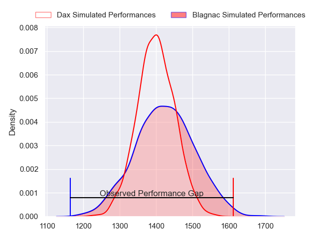
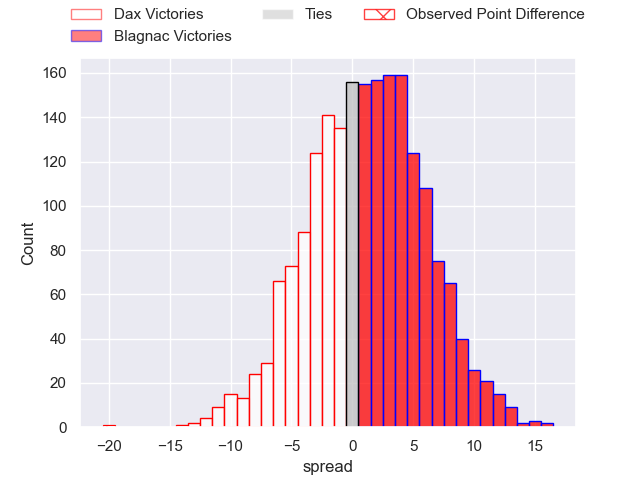
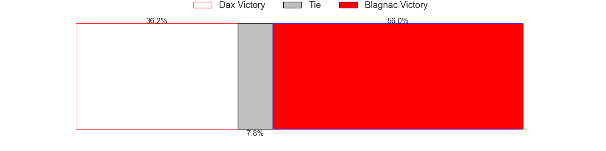

---  
layout: page  
title: Dax at Blagnac; 32-12  
date: 2023-05-13 19:30:00 18:00:00 -0500  
categories: match review  
---
# Dax at Blagnac; 32-12

# Club Level Predictions

The first set of predictions treats a club as the smallest object, as the club develops its members, organizes a gameplan, and deploys its players as needed for each match. This club model has a prediction of 0.533, which translates to predicting Blagnac to win by 1.2.

Each club has a rating and a rating deviation (simiar to a Glicko system), and expected performances can be generated. This allows for simulated matches and spreads like the ones below.
## Projected Performances

## Projected Spreads

## Projected Results

# Player Level Predictions

Treating teams instead as an entity made up of the currently active players, I have ratings for each player in an altogether different system. These can be combined to form team ratings once teamsheets are announced, weighting starters a bit higher than the reserves. After the match is played, players can be weighted by their minutes on the field, allowing for an accurate measure of the team's composition. With these compiled team ratings, we can make predictions, measure inaccuracy, and update the individual player ratings.
## Prediction with Player Minutes: Dax by 1.8

Dax by 5.8 on a neutral field

There were 4 large changes in win probability in this match
## Prediction without Player Minutes: Dax by 1.0

Dax by 5.0 on a neutral pitch

|   Away Minutes | Away Player          |   Away elo |   Away Percentile |   Number |   Home Percentile |   Home elo | Home Player          |   Home Minutes |
|---------------:|:---------------------|-----------:|------------------:|---------:|------------------:|-----------:|:---------------------|---------------:|
|             47 | Louis Mary           |      90.72 |                79 |        1 |                77 |      89.13 | Jean-Baptiste Martin |             47 |
|             47 | Louis Barrere        |      91.82 |                82 |        2 |                70 |      85.8  | Gabin Villerouge     |             47 |
|             47 | Thibaud Dréan        |      88.32 |                75 |        3 |                33 |      69.32 | Fabien Lorenzon      |             47 |
|             47 | Mattieu Bidau        |      63.17 |                22 |        4 |                84 |      96.67 | Vincent Mutel        |             71 |
|             80 | Étienne Loiret       |      82.66 |                62 |        5 |                43 |      73.58 | Lilian Rousset       |             72 |
|             80 | Arnaud Aletti        |     106.72 |                92 |        6 |                79 |      92.1  | Nikita Bekov         |             80 |
|             61 | Jean Despiau         |      73.29 |                39 |        7 |                55 |      79.25 | Benjamin Collet      |             50 |
|             80 | Brice Ferrer         |      79.49 |                54 |        8 |                85 |      98.99 | Mathieu Vachon       |             80 |
|             80 | Simon Garrouteigt    |      90.48 |                73 |        9 |                53 |      78.25 | Paul Ravier          |             63 |
|             72 | Hugo Cerisier        |      78.87 |                52 |       10 |                76 |      92.57 | Ugo Seunes           |             63 |
|             80 | Théo Gatelier        |      78.82 |                56 |       11 |                78 |      92.18 | Thibault Moleana     |             80 |
|             61 | Ilikena Bolakoro     |      80.74 |                56 |       12 |                32 |      68.99 | Aurelien Labau       |             80 |
|             80 | Rodrigo Marta        |      68.21 |                30 |       13 |                 8 |      51.41 | Clément Vareilles    |             80 |
|             68 | Guillaume Bouche     |     110.26 |                90 |       14 |                22 |      62.3  | Lukas Doyhenard      |             80 |
|             80 | Théo Duprat          |      93.03 |                75 |       15 |                64 |      86.89 | Antoine Renaud       |             80 |
|             33 | Joaquin Rodon        |      76.53 |                38 |       16 |                72 |      90.1  | Cesar Biscioni       |             33 |
|             33 | Elvis Levi           |     103.85 |                92 |       17 |                23 |      66.01 | Florian Bertrand     |             33 |
|             33 | Diogo Hasse Ferreira |      81.06 |                58 |       18 |                40 |      75.48 | Marco Trauth         |             33 |
|             33 | Matt Luamanu         |      81.18 |                64 |       19 |                10 |      56.14 | Lucas Tolofua        |              9 |
|             19 | Théo Tremeau         |      41.81 |                 3 |       20 |                19 |      62.51 | Nekolo Tolofua       |              8 |
|              8 | Gaëtan Robert        |      46.12 |                 5 |       21 |                63 |      86.81 | Ianis Ponsole        |             30 |
|             19 | Sylvère Reteau       |      75.16 |                51 |       22 |                20 |      63.78 | Corentin Penc'hoat   |             17 |
|             12 | Julien Dechavanne    |      63.17 |                23 |       23 |                49 |      76.96 | Gérald Augustin      |             17 |

