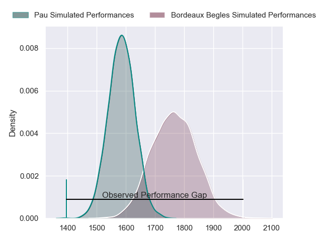
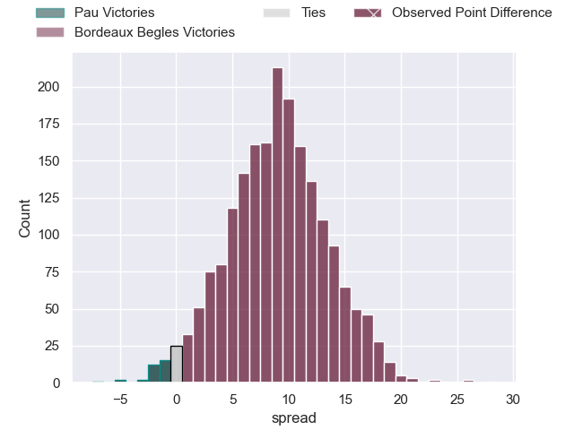
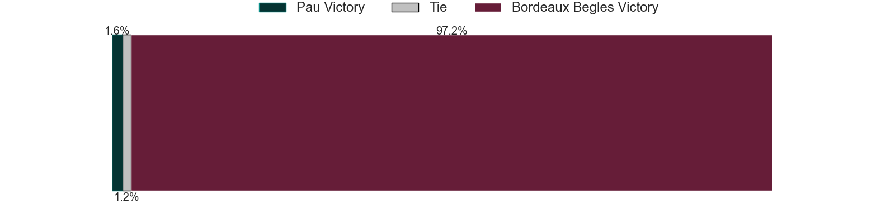

---  
layout: page  
title: Pau at Bordeaux Begles; 0-28  
date: 2023-05-13 17:00:00 18:00:00 -0500  
categories: match review  
---
# Pau at Bordeaux Begles; 0-28

# Club Level Predictions

The first set of predictions treats a club as the smallest object, as the club develops its members, organizes a gameplan, and deploys its players as needed for each match. This club model has a prediction of 0.739, which translates to predicting Bordeaux Begles to win by 9.1.

Each club has a rating and a rating deviation (simiar to a Glicko system), and expected performances can be generated. This allows for simulated matches and spreads like the ones below.
## Projected Performances

## Projected Spreads

## Projected Results

# Player Level Predictions

Treating teams instead as an entity made up of the currently active players, I have ratings for each player in an altogether different system. These can be combined to form team ratings once teamsheets are announced, weighting starters a bit higher than the reserves. After the match is played, players can be weighted by their minutes on the field, allowing for an accurate measure of the team's composition. With these compiled team ratings, we can make predictions, measure inaccuracy, and update the individual player ratings.
## Prediction with Player Minutes: Pau by 0.0

Pau by 4.0 on a neutral field

There were 4 large changes in win probability in this match
## Prediction without Player Minutes: Bordeaux Begles by 2.4

Pau by 1.6 on a neutral pitch

|   Away Minutes | Away Player              |   Away elo |   Away Percentile |   Number |   Home Percentile |   Home elo | Home Player          |   Home Minutes |
|---------------:|:-------------------------|-----------:|------------------:|---------:|------------------:|-----------:|:---------------------|---------------:|
|             54 | Ignacio David Calles     |      72.39 |                39 |        1 |                39 |      71.9  | Lesko Kaulashvili    |             41 |
|             49 | Youri Delhommel          |      69.57 |               nan |        2 |                57 |      78.75 | Maxime Lamothe       |             52 |
|             41 | Siate Tokolahi           |      76.2  |                48 |        3 |                66 |      82.2  | Vadim Cobilas        |             41 |
|             41 | Santiago Grondona        |      72.48 |                41 |        4 |                74 |      85.77 | Thomas Jolmes        |             41 |
|             57 | Guillaume Ducat          |      68.43 |                28 |        5 |                31 |      66.23 | Jan Andre Marais     |             80 |
|             80 | Sacha Zegueur            |      56.91 |                11 |        6 |                39 |      74.27 | Mahamadou Diaby      |             59 |
|             41 | Reece Hewat              |      76.3  |                48 |        7 |                29 |      67.05 | Pierre Bochaton      |             80 |
|             80 | Beka Gorgadze            |      82.46 |                61 |        8 |                36 |      71.89 | Tom Willis           |             80 |
|             57 | Thibault Daubagna        |      72.55 |                39 |        9 |                20 |      61.73 | Maxime Lucu          |             78 |
|             80 | Zack Henry               |      71.57 |                37 |       10 |                56 |      82.18 | Matthieu Jalibert    |             63 |
|             80 | Daniel Ikpefan           |      70.76 |                38 |       11 |                32 |      68.15 | Santiago Cordero     |             80 |
|             80 | Jale Vatubua             |      67.83 |                27 |       12 |                42 |      73.35 | Sipili Falatea       |             80 |
|             80 | Émilien Gailleton        |     102.87 |                86 |       13 |                66 |      87.51 | Nicolas Depoortere   |             80 |
|             80 | Clément Laporte          |      86.39 |                70 |       14 |                42 |      72.62 | Louis Bielle Biarrey |             80 |
|             41 | Mathias Colombet         |      71.48 |                35 |       15 |                36 |      71.89 | Romain Buros         |             41 |
|             39 | Guram Papidze            |      80.05 |                56 |       16 |                59 |      80.75 | Ben Tameifuna        |             39 |
|             39 | Lekima Vuda Tagitagivalu |      79.61 |                56 |       17 |                30 |      68.17 | Jean-Baptiste Dubié  |             39 |
|             39 | Clement Mondinat         |      86.96 |                65 |       18 |                50 |      76.72 | Jefferson Poirot     |             39 |
|             39 | Luke Whitelock           |      77.98 |                52 |       19 |                39 |      72.19 | Kane Douglas         |             39 |
|             31 | Lucas Rey                |      83.04 |                64 |       20 |                42 |      72.45 | Gabriel Oghre        |             28 |
|             23 | Hugo Auradou             |      84.53 |                66 |       21 |                36 |      70.32 | Caleb Timu           |             21 |
|             26 | Rémi Seneca              |      74.22 |               nan |       22 |                27 |      66.89 | Zack Holmes          |             17 |
|             23 | Dan Robson               |      73.04 |                37 |       23 |               nan |      71.98 | Yann Lesgourgues     |              2 |

