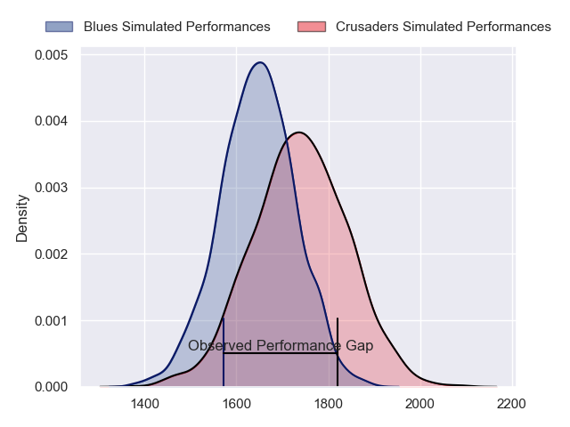
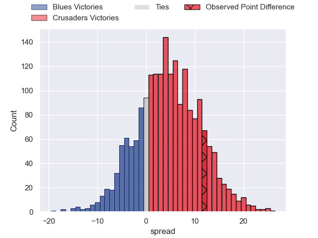

---  
layout: page  
title: Blues at Crusaders; 3.0-15.0  
date: 2023-05-13 03:05:00 18:00:00 -0500  
categories: match review  
---
# Blues at Crusaders; 3.0-15.0

# Club Level Predictions

The first set of predictions treats a club as the smallest object, as the club develops its members, organizes a gameplan, and deploys its players as needed for each match. This club model has a prediction of 0.63, which translates to predicting Crusaders to win by 4.8.

Each club has a rating and a rating deviation (simiar to a Glicko system), and expected performances can be generated. This allows for simulated matches and spreads like the ones below.
## Projected Performances

## Projected Spreads

## Projected Results

# Player Level Predictions

Treating teams instead as an entity made up of the currently active players, I have ratings for each player in an altogether different system. These can be combined to form team ratings once teamsheets are announced, weighting starters a bit higher than the reserves. After the match is played, players can be weighted by their minutes on the field, allowing for an accurate measure of the team's composition. With these compiled team ratings, we can make predictions, measure inaccuracy, and update the individual player ratings.
## Prediction with Player Minutes: Crusaders by 5.0

Crusaders by 1.0 on a neutral field

There were 5 large changes in win probability in this match
## Prediction without Player Minutes: Crusaders by 2.3

Blues by 1.7 on a neutral pitch

|   Away Minutes | Away Player       |   Away elo |   Away Percentile |   Number |   Home Percentile |   Home elo | Home Player            |   Home Minutes |
|---------------:|:------------------|-----------:|------------------:|---------:|------------------:|-----------:|:-----------------------|---------------:|
|             57 | Ofa Tu'ungafasi   |     101.31 |                90 |        1 |                74 |      87.95 | Joe Moody              |              8 |
|             53 | Ricky Riccitelli  |      85.76 |                69 |        2 |                77 |      89.81 | Codie Taylor           |             60 |
|             53 | Marcel Renata     |      83.28 |                64 |        3 |                83 |      93.4  | Tamaiti Williams       |             74 |
|             80 | Patrick Tuipulotu |     128.83 |                98 |        4 |                97 |     125.07 | Scott Barrett          |             80 |
|             15 | Sam Darry         |      97.42 |                85 |        5 |                51 |      77.16 | Quinten Strange        |             47 |
|             80 | Adrian Choat      |      86.8  |                71 |        6 |                43 |      76.21 | Christian Lio-Willie   |             57 |
|             64 | Dalton Papali'i   |     104.72 |                91 |        7 |                84 |      97.19 | Tom Christie           |             80 |
|             80 | Hoskins Sotutu    |     115.04 |                96 |        8 |                95 |     113.01 | Cullen Grace           |             80 |
|             69 | Finlay Christie   |      98.88 |                85 |        9 |                62 |      83.65 | Mitchell Drummond      |             60 |
|             80 | Beauden Barrett   |     145.83 |               100 |       10 |                99 |     141.16 | Richie Mo'unga         |             80 |
|             59 | Caleb Clarke      |      98.02 |                85 |       11 |                53 |      77.4  | Leicester Fainga'anuku |             80 |
|             59 | Harry Plummer     |      98.42 |                82 |       12 |                95 |     114.89 | David Havili           |             80 |
|             80 | Rieko Ioane       |      83.46 |                62 |       13 |                86 |     102.41 | Braydon Ennor          |             80 |
|             80 | Mark Telea        |     108.14 |                93 |       14 |                87 |      99.1  | Dallas McLeod          |             57 |
|             80 | Zarn Sullivan     |      84.22 |                65 |       15 |                96 |     125.94 | Will Jordan            |             80 |
|             27 | Kurt Eklund       |     117.38 |                97 |       16 |                89 |     101.2  | Brodie McAlister       |             20 |
|             23 | Jordan Lay        |      64.71 |                23 |       17 |                64 |      82.5  | Kershawl Sykes-Martin  |             14 |
|             27 | James Lay         |      83.84 |                65 |       18 |                92 |     104.79 | Oli Jager              |             64 |
|             65 | Cameron Suafoa    |     100.22 |                88 |       19 |                67 |      84.99 | Zach Gallagher         |             33 |
|             16 | Akira Ioane       |     110.38 |                94 |       20 |                47 |      75.89 | Sione Havili           |             23 |
|             11 | Sam Nock          |      95.9  |                81 |       21 |                87 |     101.97 | Noah Hotham            |             20 |
|             21 | Bryce Heem        |      99.16 |                83 |       22 |                49 |      79.23 | Fergus Burke           |              0 |
|             21 | AJ Lam            |      71.62 |                40 |       23 |                84 |      99.69 | Jack Goodhue           |             23 |

