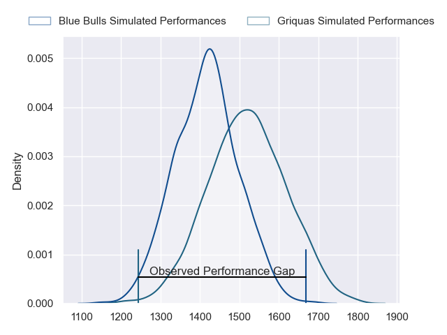
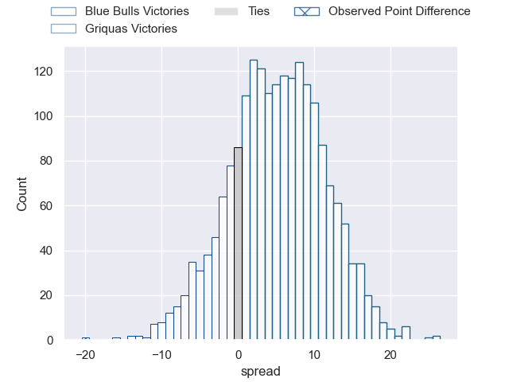
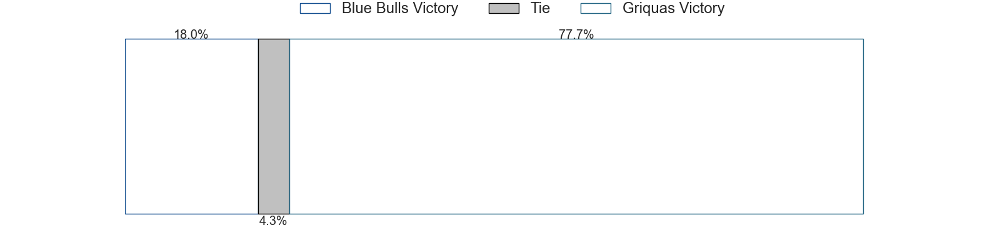

---  
layout: page  
title: Blue Bulls at Griquas; 40-20  
date: 2023-05-13 15:00:00 18:00:00 -0500  
categories: match review  
---
# Blue Bulls at Griquas; 40-20

# Club Level Predictions

The first set of predictions treats a club as the smallest object, as the club develops its members, organizes a gameplan, and deploys its players as needed for each match. This club model has a prediction of 0.637, which translates to predicting Griquas to win by 5.0.

Each club has a rating and a rating deviation (simiar to a Glicko system), and expected performances can be generated. This allows for simulated matches and spreads like the ones below.
## Projected Performances

## Projected Spreads

## Projected Results

# Player Level Predictions

Treating teams instead as an entity made up of the currently active players, I have ratings for each player in an altogether different system. These can be combined to form team ratings once teamsheets are announced, weighting starters a bit higher than the reserves. After the match is played, players can be weighted by their minutes on the field, allowing for an accurate measure of the team's composition. With these compiled team ratings, we can make predictions, measure inaccuracy, and update the individual player ratings.
## Prediction with Player Minutes: Blue Bulls by 6.1

Blue Bulls by 10.1 on a neutral field
## Prediction without Player Minutes: Blue Bulls by 6.1

Blue Bulls by 10.1 on a neutral pitch

|   Away Minutes | Away Player                  |   Away elo |   Away Percentile |   Number |   Home Percentile |   Home elo | Home Player         |   Home Minutes |
|---------------:|:-----------------------------|-----------:|------------------:|---------:|------------------:|-----------:|:--------------------|---------------:|
|             80 | Gerhardus Cornelis Steenkamp |      77.9  |                53 |        1 |                35 |      70.75 | Kudzwai Dube        |             80 |
|             80 | Cornelis Johannes Grobbelaar |      85.95 |                71 |        2 |                47 |      74.53 | Janco Uys           |             80 |
|             80 | Mornay Jan Jakobus Smith     |      82.39 |                63 |        3 |                59 |      80.71 | Janu Botha          |             80 |
|             80 | Ruan Vermaak                 |      82.01 |                61 |        4 |                18 |      60.57 | Derrick Pretorius   |             80 |
|             80 | Ruan Nortje                  |      91.33 |                76 |        5 |               nan |      68.88 | Dylan Sjoblom       |             80 |
|             80 | Marcell Coetzee              |      85.06 |                66 |        6 |                48 |      76.08 | Thabo Ndimande      |             80 |
|             80 | Nizaam Carr                  |      66.6  |                27 |        7 |                74 |      89.2  | Hanru Sirgel        |             80 |
|             80 | Elrigh Louw                  |      90.99 |                77 |        8 |                24 |      65.59 | Carl Els            |             80 |
|             80 | Embrose Cheldon Papier       |      71.76 |                38 |        9 |                29 |      67.81 | Johan Mulder        |             80 |
|             80 | Chris Smith                  |      83.99 |                60 |       10 |                49 |      76.52 | Lubabalo Dobela     |             80 |
|             80 | Marco Jansen van Vuuren      |      78.72 |               nan |       11 |                46 |      74.47 | Sakoyisa Makata     |             80 |
|             80 | Harold William Vorster       |      93.32 |                75 |       12 |                42 |      73.79 | Tertius Kruger      |             80 |
|             80 | Stedman-Gee Rivett Gans      |      91.16 |                72 |       13 |                83 |      98.96 | Jay Cee Nel         |             80 |
|             80 | Sibongile Vukile Novuka      |      79.83 |                62 |       14 |                21 |      61.54 | Rosco Shane Specman |             80 |
|             80 | David Kriel                  |      77.87 |                54 |       15 |                80 |      98.16 | Ashlon Davids       |             80 |

