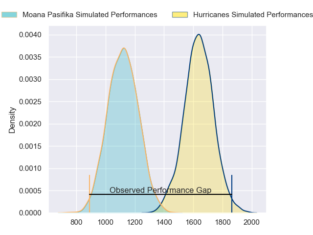
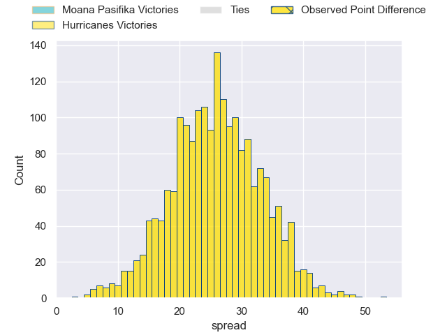

---  
layout: page  
title: Moana Pasifika at Hurricanes; 22.0-71.0  
date: 2023-05-13 00:35:00 18:00:00 -0500  
categories: match review  
---
# Moana Pasifika at Hurricanes; 22.0-71.0

# Club Level Predictions

The first set of predictions treats a club as the smallest object, as the club develops its members, organizes a gameplan, and deploys its players as needed for each match. This club model has a prediction of 0.944, which translates to predicting Hurricanes to win by 25.8.

Each club has a rating and a rating deviation (simiar to a Glicko system), and expected performances can be generated. This allows for simulated matches and spreads like the ones below.
## Projected Performances

## Projected Spreads

## Projected Results

# Player Level Predictions

Treating teams instead as an entity made up of the currently active players, I have ratings for each player in an altogether different system. These can be combined to form team ratings once teamsheets are announced, weighting starters a bit higher than the reserves. After the match is played, players can be weighted by their minutes on the field, allowing for an accurate measure of the team's composition. With these compiled team ratings, we can make predictions, measure inaccuracy, and update the individual player ratings.
## Prediction with Player Minutes: Hurricanes by 24.3

Hurricanes by 20.3 on a neutral field

There were 5 large changes in win probability in this match
## Prediction without Player Minutes: Hurricanes by 26.9

Hurricanes by 22.9 on a neutral pitch

|   Away Minutes | Away Player         |   Away elo |   Away Percentile |   Number |   Home Percentile |   Home elo | Home Player          |   Home Minutes |
|---------------:|:--------------------|-----------:|------------------:|---------:|------------------:|-----------:|:---------------------|---------------:|
|             41 | Ezekiel Lindenmuth  |      74.13 |                43 |        1 |                87 |      90.81 | Tevita Mafileo       |             51 |
|             80 | Luteru Tolai        |      99.93 |                88 |        2 |               nan |      85.22 | Jacob Devery         |             55 |
|             41 | Isileli Tu'ungafasi |      50.78 |                 6 |        3 |                99 |     135.28 | Tyrel Lomax          |             58 |
|             80 | Alex McRobbie       |      67.07 |                28 |        4 |                65 |      83.89 | James Blackwell      |             80 |
|             61 | Mahroni Ngakuru     |      51.83 |                 8 |        5 |                88 |     100.38 | Isaia Walker-Leawere |             51 |
|             56 | Sione Tu'ipulotu    |      76.99 |               nan |        6 |                56 |      79.66 | Devan Flanders       |             80 |
|             80 | Penitoa Finau       |      74.27 |               nan |        7 |                66 |      85.1  | Du'Plessis Kirifi    |             67 |
|             67 | Lotu Inisi          |      92.79 |                80 |        8 |                98 |     119.92 | Ardie Savea          |             80 |
|             80 | Jonathan Taumateine |      67.21 |                27 |        9 |                 6 |      48.44 | Jamie Booth          |             61 |
|             80 | Lincoln McClutchie  |      93.84 |                77 |       10 |                52 |      78.99 | Aidan Morgan         |             70 |
|             54 | Anzelo Tuitavuki    |      44.97 |                 5 |       11 |                93 |     106.9  | Kini Naholo          |             61 |
|             80 | Henry Taefu         |      50.94 |                 8 |       12 |                92 |     108.34 | Jordie Barrett       |             80 |
|             67 | Danny Toala         |      89.72 |                70 |       13 |                91 |     107.04 | Billy Proctor        |             80 |
|             65 | Tima Fainga'anuku   |     104.64 |                91 |       14 |                56 |      77.91 | Salesi Rayasi        |             80 |
|             80 | Tomasi Alosio       |      73.54 |               nan |       15 |                32 |      69.63 | Harry Godfrey        |             80 |
|             13 | Joe Royal           |      74.07 |               nan |       16 |                51 |      76.13 | Hame Faiva           |             25 |
|             39 | Tau Koloamatangi    |     112.06 |                96 |       17 |                63 |      83.07 | Pouri Rakete-Stones  |             29 |
|             39 | Chris Apoua         |      74.7  |                45 |       18 |               nan |      90.21 | Pasilio Tosi         |             22 |
|             19 | Potu Leavasa        |      68.15 |                35 |       19 |                82 |      93.09 | Caleb Delany         |             29 |
|             24 | Jonah Mau'u         |      83.1  |                60 |       20 |                18 |      57.61 | Brayden Iose         |             13 |
|             13 | Sam Wye             |      73.89 |               nan |       21 |               nan |      83.95 | Logan Henry          |             19 |
|             15 | William Havili      |     104.34 |                86 |       22 |                63 |      84.95 | Peter Umaga-Jensen   |             10 |
|             26 | Lolagi Visinia      |      73.71 |               nan |       23 |                54 |      81.57 | Joshua Moorby        |             19 |

