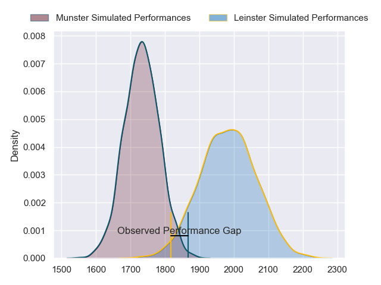
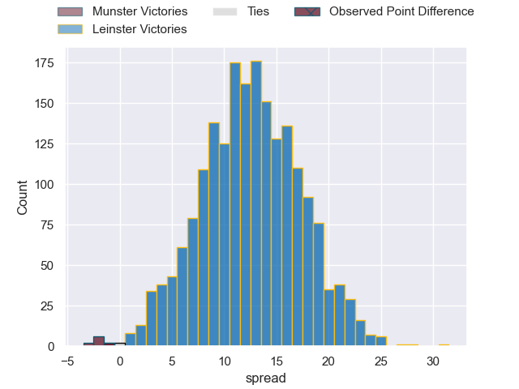

---  
layout: page  
title: Munster at Leinster; 16-15  
date: 2023-05-13 18:30:00 18:00:00 -0500  
categories: match review  
---
# Munster at Leinster; 16-15

# Club Level Predictions

The first set of predictions treats a club as the smallest object, as the club develops its members, organizes a gameplan, and deploys its players as needed for each match. This club model has a prediction of 0.808, which translates to predicting Leinster to win by 12.6.

Each club has a rating and a rating deviation (simiar to a Glicko system), and expected performances can be generated. This allows for simulated matches and spreads like the ones below.
## Projected Performances

## Projected Spreads

## Projected Results

# Player Level Predictions

Treating teams instead as an entity made up of the currently active players, I have ratings for each player in an altogether different system. These can be combined to form team ratings once teamsheets are announced, weighting starters a bit higher than the reserves. After the match is played, players can be weighted by their minutes on the field, allowing for an accurate measure of the team's composition. With these compiled team ratings, we can make predictions, measure inaccuracy, and update the individual player ratings.
## Prediction with Player Minutes: Leinster by 22.2

Leinster by 18.2 on a neutral field

There were 8 large changes in win probability in this match
## Prediction without Player Minutes: Leinster by 20.1

Leinster by 16.1 on a neutral pitch

|   Away Minutes | Away Player      |   Away elo |   Away Percentile |   Number |   Home Percentile |   Home elo | Home Player          |   Home Minutes |
|---------------:|:-----------------|-----------:|------------------:|---------:|------------------:|-----------:|:---------------------|---------------:|
|             51 | Jeremy Loughman  |      88.77 |                76 |        1 |                61 |      81.74 | Michael Milne        |             46 |
|             51 | Diarmuid Barron  |      88.85 |                75 |        2 |                95 |     110.78 | Ronan Kelleher       |             64 |
|             50 | Stephen Archer   |      88.98 |                76 |        3 |                57 |      79.79 | Michael Ala'alatoa   |             70 |
|             45 | Jean Kleyn       |      83.43 |                64 |        4 |                83 |      96.16 | Ryan Baird           |             80 |
|             70 | Tadhg Beirne     |      85.13 |                67 |        5 |                65 |      84.35 | Jason Howell Jenkins |             58 |
|             50 | Peter O'Mahony   |      60.67 |                18 |        6 |                59 |      81.17 | Max Deegan           |             80 |
|             80 | John Hodnett     |      69.87 |                21 |        7 |                48 |      76.17 | Will Connors         |              1 |
|             80 | Gavin Coombes    |      86.24 |                68 |        8 |                99 |     129.12 | Jack Conan           |             80 |
|             80 | Craig Casey      |      97.5  |                82 |        9 |                59 |      81.36 | Luke McGrath         |             67 |
|             36 | Ben Healy        |      78.15 |               nan |       10 |                55 |      81.06 | Harry Byrne          |             80 |
|             80 | Sean French      |      59.66 |                18 |       11 |                54 |      77.97 | Dave Kearney         |             80 |
|             80 | Jack Crowley     |      84.64 |                62 |       12 |                73 |      91.9  | Charlie Ngatai       |             78 |
|             80 | Antoine Frisch   |      95.5  |                77 |       13 |                99 |     147.92 | Robbie Henshaw       |             80 |
|             80 | Keith Earls      |      74.59 |               nan |       14 |                50 |      76.29 | Tommy O'Brien        |             80 |
|             80 | Michael Haley    |      83.58 |                57 |       15 |                71 |      86.88 | Jimmy O'Brien        |             41 |
|             44 | Rory Scannell    |      77.22 |               nan |       16 |                93 |     109.9  | Josh van der Flier   |             79 |
|             35 | Fineen Wycherley |      80.13 |                45 |       17 |                55 |      80.3  | Ciaran Frawley       |             39 |
|             30 | Jack O'Donoghue  |      74.65 |                41 |       18 |               nan |      91.54 | Cian Healy           |             34 |
|             30 | Roman Salanoa    |     100.34 |                89 |       19 |               nan |      81.32 | Joe McCarthy         |             22 |
|             29 | Josh Wycherley   |      77.54 |                57 |       20 |                50 |      78.13 | John McKee           |             16 |
|             29 | Niall Scannell   |      82.39 |                56 |       21 |                54 |      78.88 | Nick McCarthy        |             13 |
|             10 | Alex Kendellen   |      93.67 |                80 |       22 |                65 |      83.91 | Tom Clarkson         |             10 |
|            nan | nan              |     nan    |               nan |       23 |                57 |      83.31 | Liam Turner          |              2 |

