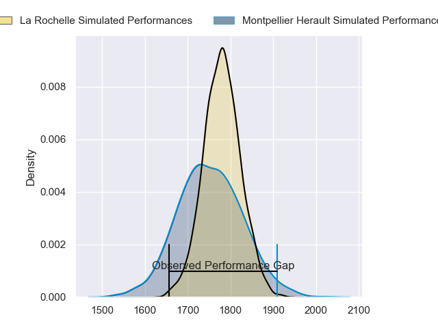
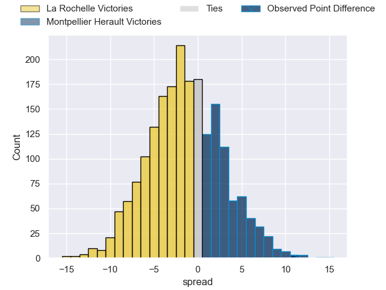
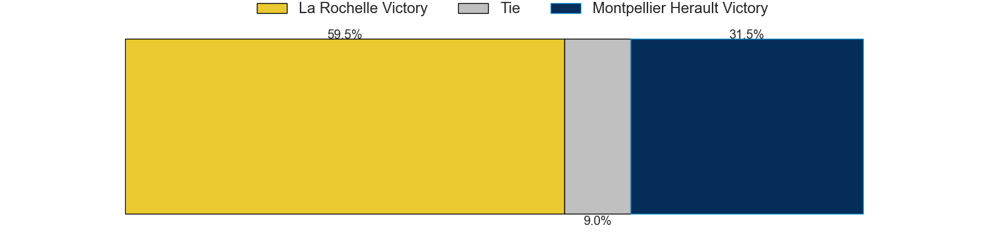

---  
layout: page  
title: La Rochelle at Montpellier Herault; 31-42  
date: 2023-05-13 17:00:00 18:00:00 -0500  
categories: match review  
---
# La Rochelle at Montpellier Herault; 31-42

# Club Level Predictions

The first set of predictions treats a club as the smallest object, as the club develops its members, organizes a gameplan, and deploys its players as needed for each match. This club model has a prediction of 0.465, which translates to predicting La Rochelle to win by 1.2.

Each club has a rating and a rating deviation (simiar to a Glicko system), and expected performances can be generated. This allows for simulated matches and spreads like the ones below.
## Projected Performances

## Projected Spreads

## Projected Results

# Player Level Predictions

Treating teams instead as an entity made up of the currently active players, I have ratings for each player in an altogether different system. These can be combined to form team ratings once teamsheets are announced, weighting starters a bit higher than the reserves. After the match is played, players can be weighted by their minutes on the field, allowing for an accurate measure of the team's composition. With these compiled team ratings, we can make predictions, measure inaccuracy, and update the individual player ratings.
## Prediction with Player Minutes: La Rochelle by 28.8

La Rochelle by 32.8 on a neutral field

There were 18 large changes in win probability in this match
## Prediction without Player Minutes: La Rochelle by 30.0

La Rochelle by 34.0 on a neutral pitch

|   Away Minutes | Away Player              |   Away elo |   Away Percentile |   Number |   Home Percentile |   Home elo | Home Player            |   Home Minutes |
|---------------:|:-------------------------|-----------:|------------------:|---------:|------------------:|-----------:|:-----------------------|---------------:|
|             41 | Thierry Paiva            |      80.55 |               nan |        1 |                 7 |      52.4  | Enzo Forletta          |             53 |
|             41 | Samuel Lagrange          |      83.78 |               nan |        2 |                21 |      59.99 | Vincent Giudicelli     |             58 |
|             53 | Georges-Henri Colombe    |      81.09 |                50 |        3 |                 5 |      49.45 | Henry Thomas           |             53 |
|             58 | Thomas Lavault           |      98.85 |                85 |        4 |                16 |      59.52 | Florian Verhaeghe      |             80 |
|             80 | Rémi Picquette           |      94.52 |                81 |        5 |                16 |      59.79 | Bastien Chalureau      |             53 |
|             65 | Rémi Bourdeau            |      73.63 |                43 |        6 |                 0 |      22.9  | Alexandre Bécognée     |             80 |
|             62 | Kyle Hatherell           |      77.22 |                52 |        7 |                12 |      55.81 | Masivesi Dakuwaqa      |             24 |
|             80 | Yoan Tanga Mangene       |      76.27 |                46 |        8 |                55 |      79.86 | Zach Mercer            |             80 |
|             56 | Jules Le Bail            |      79.65 |                55 |        9 |                31 |      68.46 | Jacobus Meyer Reinach  |             48 |
|             80 | Hugo Reus                |      72.49 |                41 |       10 |                 6 |      47.38 | Louis Carbonel         |             68 |
|             58 | Martin Alonso Munoz      |      80.74 |                60 |       11 |                52 |      76.71 | George Bridge          |             80 |
|             80 | Jonathan Danty           |     102.25 |                86 |       12 |                11 |      54.76 | Jan Lodewyk Serfontein |             80 |
|             80 | Victor Olivier           |      80.74 |               nan |       13 |                34 |      70.29 | Thomas Darmon          |             80 |
|             80 | Pierre Boudehent         |      85.87 |                69 |       14 |                41 |      71.86 | Vincent Rattez         |             64 |
|             80 | Pierre Popelin           |      81.13 |               nan |       15 |                40 |      74.1  | Anthony Bouthier       |             80 |
|             39 | Sacha Idoumi             |      85.26 |               nan |       16 |                49 |      79.73 | Clément Doumenc        |             56 |
|             39 | Hayden Thompson-Stringer |      90.25 |                75 |       17 |               nan |      75.69 | Gela Aprasidze         |             32 |
|             27 | Aleksandre Kuntelia      |      83.53 |                79 |       18 |                27 |      66.33 | Titi Lamositele        |             27 |
|             24 | Lucas Zamora             |      90.77 |               nan |       19 |                27 |      69.9  | Grégory Fichten        |             27 |
|             22 | Thomas Ployet            |      80.93 |               nan |       20 |                32 |      70.7  | Tyler Evan Duguid      |             27 |
|             22 | Hoani Bosmorin           |      81.35 |               nan |       21 |               nan |      33.43 | Jérémie Maurouard      |             22 |
|             18 | Levani Botia             |      90.39 |                76 |       22 |               nan |      46.68 | Pierre Lucas           |             16 |
|             15 | Noé Della Schiava        |      94.77 |               nan |       23 |                77 |      94.16 | Paolo Garbisi          |             12 |

