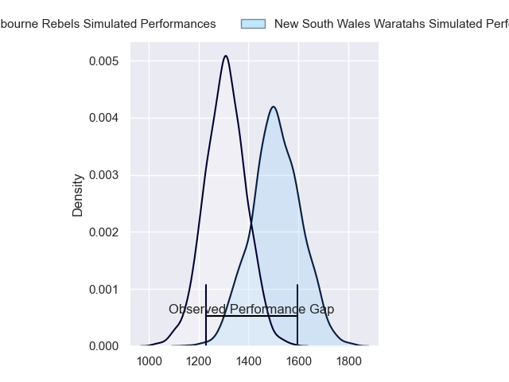
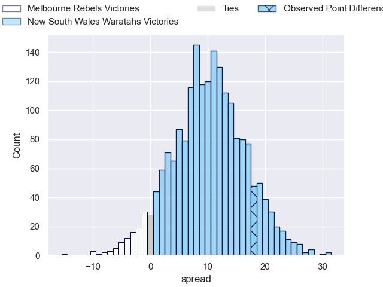
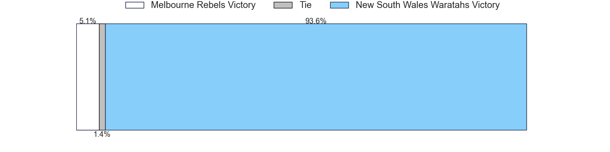

---  
layout: page  
title: Melbourne Rebels at New South Wales Waratahs; 20.0-38.0  
date: 2023-05-13 05:35:00 18:00:00 -0500  
categories: match review  
---
# Melbourne Rebels at New South Wales Waratahs; 20.0-38.0

# Club Level Predictions

The first set of predictions treats a club as the smallest object, as the club develops its members, organizes a gameplan, and deploys its players as needed for each match. This club model has a prediction of 0.754, which translates to predicting New South Wales Waratahs to win by 10.1.

Each club has a rating and a rating deviation (simiar to a Glicko system), and expected performances can be generated. This allows for simulated matches and spreads like the ones below.
## Projected Performances

## Projected Spreads

## Projected Results

# Player Level Predictions

Treating teams instead as an entity made up of the currently active players, I have ratings for each player in an altogether different system. These can be combined to form team ratings once teamsheets are announced, weighting starters a bit higher than the reserves. After the match is played, players can be weighted by their minutes on the field, allowing for an accurate measure of the team's composition. With these compiled team ratings, we can make predictions, measure inaccuracy, and update the individual player ratings.
## Prediction with Player Minutes: New South Wales Waratahs by 8.3

New South Wales Waratahs by 4.3 on a neutral field

There were 10 large changes in win probability in this match
## Prediction without Player Minutes: New South Wales Waratahs by 7.5

New South Wales Waratahs by 3.5 on a neutral pitch

|   Away Minutes | Away Player      |   Away elo |   Away Percentile |   Number |   Home Percentile |   Home elo | Home Player          |   Home Minutes |
|---------------:|:-----------------|-----------:|------------------:|---------:|------------------:|-----------:|:---------------------|---------------:|
|             64 | Matt Gibbon      |      94.86 |                86 |        1 |                75 |      88.16 | Tetera Faulkner      |             61 |
|             55 | Jordan Uelese    |      77.79 |                53 |        2 |                92 |     104.18 | Dave Porecki         |             65 |
|             56 | Sam Talakai      |      91.44 |                81 |        3 |                70 |      85.86 | Harry Johnson-Holmes |             66 |
|             80 | Josh Canham      |      82.03 |                61 |        4 |                49 |      76.5  | Jed Holloway         |             80 |
|             70 | Trevor Hosea     |      81.95 |                61 |        5 |                83 |      95.9  | Hugh Sinclair        |             80 |
|             61 | Vaiolini Ekuasi  |      82.96 |                59 |        6 |                78 |      90.24 | Will Harris          |             61 |
|             80 | Brad Wilkin      |      86.87 |                71 |        7 |                99 |     140.87 | Michael Hooper       |             80 |
|             80 | Richard Hardwick |      83.31 |                62 |        8 |                75 |      89.67 | Langi Gleeson        |             77 |
|             70 | Ryan Louwrens    |     104.48 |                90 |        9 |                95 |     112.65 | Jake Gordon          |             76 |
|             80 | Carter Gordon    |      90.67 |                73 |       10 |                64 |      86.45 | Ben Donaldson        |             80 |
|             64 | Monty Ioane      |     118.57 |                97 |       11 |                85 |      98.19 | Dylan Pietsch        |             80 |
|             41 | David Feliuai    |      90.73 |                70 |       12 |                73 |      91.94 | Lalakai Foketi       |             31 |
|             80 | Reece Hodge      |     113.04 |                94 |       13 |                47 |      76.15 | Izaia Perese         |             80 |
|             80 | Lachie Anderson  |      77.36 |                53 |       14 |                78 |      92.5  | Mark Nawaqanitawase  |             80 |
|             80 | Andrew Kellaway  |      98.13 |                80 |       15 |                84 |     101.53 | Max Jorgensen        |             76 |
|             25 | Alex Mafi        |      87.51 |                74 |       16 |                 8 |      49.71 | Mahe Vailanu         |             15 |
|             16 | Cabous Eloff     |      74.32 |                40 |       17 |               nan |      76.17 | Nephi Leatigaga      |             19 |
|             24 | Pone Fa'amausili |      86.1  |                70 |       18 |                75 |      88.31 | Archer Holz          |             14 |
|             10 | Tim Cardall      |     102.94 |               nan |       19 |               nan |      85.36 | Tiaan Tauakipulu     |              0 |
|             19 | Tamati Ioane     |      83.53 |                54 |       20 |                65 |      84.45 | Charlie Gamble       |             19 |
|             10 | James Tuttle     |      94.65 |                78 |       21 |               nan |      81.03 | Teddy Wilson         |              4 |
|             39 | Stacey Ili       |      81.19 |                56 |       22 |                62 |      86.5  | Harry Wilson         |              4 |
|             16 | Joe Pincus       |      82.08 |                54 |       23 |                53 |      79.75 | Joey Walton          |             49 |

