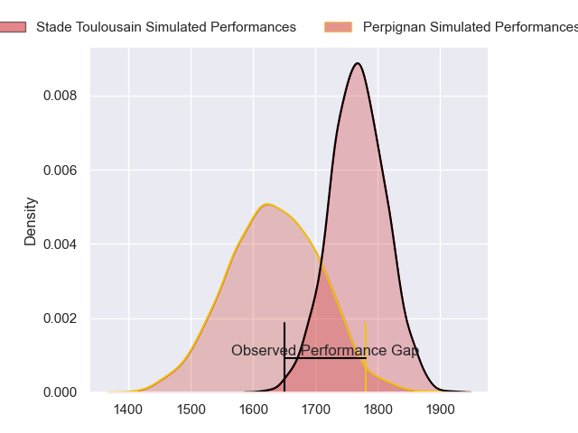
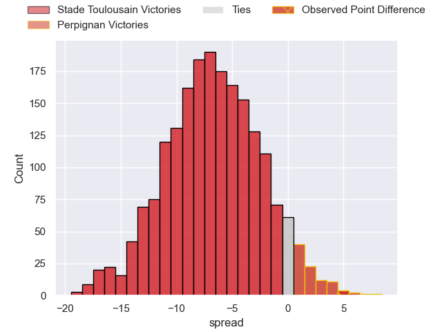
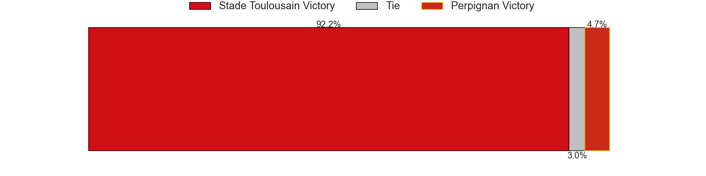

---  
layout: page  
title: Stade Toulousain at Perpignan; 21-26  
date: 2023-05-13 15:00:00 18:00:00 -0500  
categories: match review  
---
# Stade Toulousain at Perpignan; 21-26

# Club Level Predictions

The first set of predictions treats a club as the smallest object, as the club develops its members, organizes a gameplan, and deploys its players as needed for each match. This club model has a prediction of 0.322, which translates to predicting Stade Toulousain to win by 6.5.

Each club has a rating and a rating deviation (simiar to a Glicko system), and expected performances can be generated. This allows for simulated matches and spreads like the ones below.
## Projected Performances

## Projected Spreads

## Projected Results

# Player Level Predictions

Treating teams instead as an entity made up of the currently active players, I have ratings for each player in an altogether different system. These can be combined to form team ratings once teamsheets are announced, weighting starters a bit higher than the reserves. After the match is played, players can be weighted by their minutes on the field, allowing for an accurate measure of the team's composition. With these compiled team ratings, we can make predictions, measure inaccuracy, and update the individual player ratings.
## Prediction with Player Minutes: Perpignan by 2.2

Stade Toulousain by 1.8 on a neutral field

There were 15 large changes in win probability in this match
## Prediction without Player Minutes: Stade Toulousain by 0.5

Stade Toulousain by 4.5 on a neutral pitch

|   Away Minutes | Away Player         |   Away elo |   Away Percentile |   Number |   Home Percentile |   Home elo | Home Player        |   Home Minutes |
|---------------:|:--------------------|-----------:|------------------:|---------:|------------------:|-----------:|:-------------------|---------------:|
|             55 | David Ainu'u        |      54.78 |                14 |        1 |                55 |      78.76 | Giorgi Tetrashvili |             55 |
|             55 | Julien Marchand     |      90.73 |                78 |        2 |                33 |      68.1  | Seilala Lam        |             60 |
|             55 | Paul Mallez         |      79.68 |               nan |        3 |                43 |      74.26 | Arthur Joly        |             60 |
|             55 | Joshua Brennan      |      66.42 |                30 |        4 |                44 |      70.91 | Tristan Labouteley |             80 |
|             80 | Richie Arnold       |      67.32 |                29 |        5 |                62 |      82.59 | Posolo Tuilagi     |             55 |
|             60 | Alban Placines      |      70.86 |                41 |        6 |                40 |      72.31 | Brad Shields       |             80 |
|             60 | Francois Cros       |     142.61 |                99 |        7 |                51 |      78.48 | Kélian Galletier   |             60 |
|             80 | Alexandre Roumat    |      23.23 |                 0 |        8 |                37 |      70.99 | Joaquin Oviedo     |             60 |
|             80 | Paul Graou          |      85.62 |                70 |        9 |                41 |      72.93 | Sadek Deghmache    |             76 |
|             80 | Thomas Ramos        |     119.58 |                95 |       10 |                48 |      76.28 | Jake McIntyre      |             80 |
|             80 | Matthis Lebel       |      46.38 |                 5 |       11 |                15 |      58.19 | George Tilsley     |             80 |
|             80 | Santiago Chocobares |      54.06 |                10 |       12 |                17 |      59.51 | Dorian Laborde     |             80 |
|             60 | Pierre Fouyssac     |      72.16 |                38 |       13 |                44 |      73.47 | Edward Sawailau    |             80 |
|             60 | Arthur Retière      |      64.73 |                26 |       14 |                58 |      79.57 | Lucas Dubois       |             80 |
|             80 | Juan Cruz Mallia    |      60.26 |                25 |       15 |                46 |      77.22 | Tristan Tedder     |             80 |
|             25 | Cyril Baille        |      97.34 |                88 |       16 |                31 |      68.23 | Piula Fa'asalele   |             25 |
|             25 | Peato Mauvaka       |      43.31 |                 6 |       17 |                18 |      61.28 | Sacha Lotrian      |             25 |
|             25 | Dorian Aldegheri    |      83.89 |                65 |       18 |               nan |      67.43 | Siua Halanukonuka  |             20 |
|             25 | Rynhard Elstadt     |      64.29 |                27 |       19 |                26 |      65.81 | Lucas Bachelier    |             20 |
|             20 | Lucas Tauzin        |      71.11 |               nan |       20 |                31 |      66.78 | Mike Tadjer        |             20 |
|             20 | Paul Costes         |      84.33 |               nan |       21 |                14 |      58.09 | Lucas Velarte      |             20 |
|             20 | Theo Ntamack        |      64.54 |                34 |       22 |                13 |      57.14 | Tom Ecochard       |              4 |
|             20 | Jack Willis         |     110.54 |                94 |       23 |               nan |     nan    | nan                |            nan |

