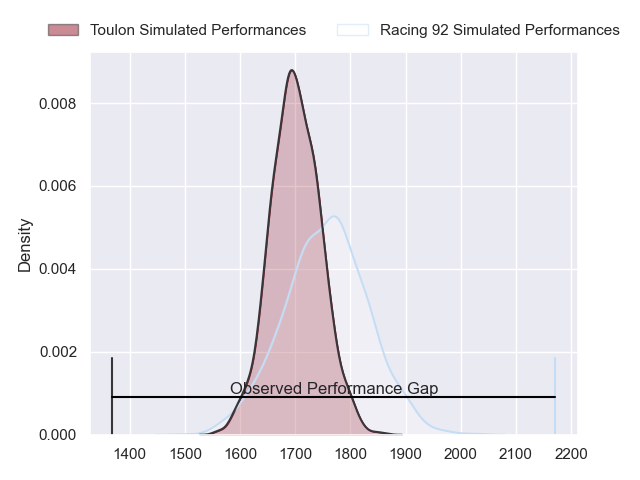
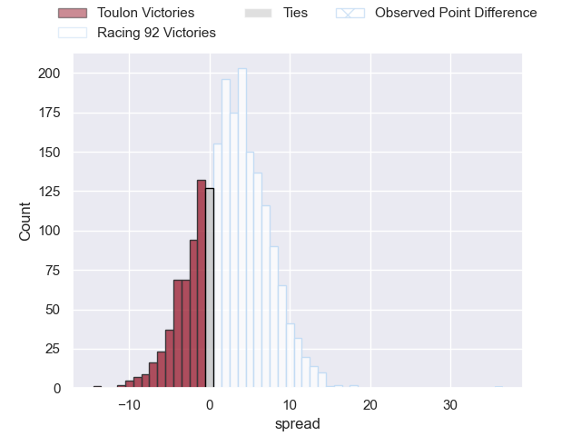
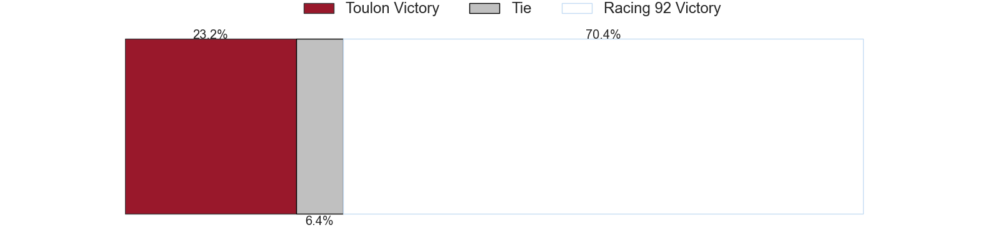

---  
layout: page  
title: Toulon at Racing 92; 7-43  
date: 2023-05-13 21:05:00 18:00:00 -0500  
categories: match review  
---
# Toulon at Racing 92; 7-43

# Club Level Predictions

The first set of predictions treats a club as the smallest object, as the club develops its members, organizes a gameplan, and deploys its players as needed for each match. This club model has a prediction of 0.576, which translates to predicting Racing 92 to win by 2.7.

Each club has a rating and a rating deviation (simiar to a Glicko system), and expected performances can be generated. This allows for simulated matches and spreads like the ones below.
## Projected Performances

## Projected Spreads

## Projected Results

# Player Level Predictions

Treating teams instead as an entity made up of the currently active players, I have ratings for each player in an altogether different system. These can be combined to form team ratings once teamsheets are announced, weighting starters a bit higher than the reserves. After the match is played, players can be weighted by their minutes on the field, allowing for an accurate measure of the team's composition. With these compiled team ratings, we can make predictions, measure inaccuracy, and update the individual player ratings.
## Prediction with Player Minutes: Racing 92 by 8.7

Racing 92 by 4.7 on a neutral field

There were 3 large changes in win probability in this match
## Prediction without Player Minutes: Racing 92 by 8.6

Racing 92 by 4.6 on a neutral pitch

|   Away Minutes | Away Player         |   Away elo |   Away Percentile |   Number |   Home Percentile |   Home elo | Home Player           |   Home Minutes |
|---------------:|:--------------------|-----------:|------------------:|---------:|------------------:|-----------:|:----------------------|---------------:|
|             53 | Jean-Baptiste Gros  |      74.86 |               nan |        1 |                 6 |      51.28 | Guram Gogichashvili   |             53 |
|             53 | Teddy Baubigny      |      76.71 |                46 |        2 |               nan |      72.56 | Camille Chat          |             53 |
|             53 | Kieran Brookes      |      75.11 |                60 |        3 |                65 |      83.86 | Trevor Ntando Nyakane |             80 |
|             58 | Mattéo Le Corvec    |      97.82 |                84 |        4 |                37 |      71.13 | Fabien Sanconnie      |             80 |
|             80 | Adrien Warion       |      93.45 |                74 |        5 |                57 |      79.66 | Veikoso Poloniati     |             60 |
|             27 | Jules Coulon        |      79.41 |                55 |        6 |                19 |      61.14 | Ibrahim Diallo        |             56 |
|             80 | Raphaël Lakafia     |      74.04 |               nan |        7 |                67 |      85.2  | Baptiste Chouzenoux   |             80 |
|             80 | Mathieu Bastareaud  |      73.32 |                40 |        8 |                32 |      70.09 | Kitione Kamikamica    |             80 |
|             53 | Benoit Paillaugue   |      72.08 |                32 |        9 |                81 |      96.45 | Nolann Le Garrec      |             80 |
|             80 | Ihaia West          |      55.09 |                11 |       10 |                90 |     106.59 | Finn Russell          |             60 |
|             60 | Aymeric Luc         |      84.25 |                60 |       11 |                83 |      96.64 | Juan Imhoff           |             80 |
|             80 | Atila Septar        |      59.31 |                17 |       12 |                43 |      74.71 | Henry Chavancy        |             53 |
|             80 | Mathieu Smaili      |      74.22 |               nan |       13 |                76 |      94.52 | Gael Fickou           |             80 |
|             80 | Gaël Dréan          |      78.94 |                56 |       14 |                40 |      71.4  | Vinaya Habosi         |             80 |
|             80 | Marius Domon        |      53.95 |                11 |       15 |                49 |      78.77 | Max Spring            |             56 |
|             53 | Charles Ollivon     |     122.02 |                97 |       16 |                24 |      62.42 | Janick Tarrit         |             27 |
|             27 | Beka Gigashvili     |      79.93 |                57 |       17 |                59 |      81.01 | Francis Saili         |             27 |
|             27 | Bruce Devaux        |      67.85 |                25 |       18 |                42 |      78.95 | Eddy Ben Arous        |             27 |
|             27 | Christopher Tolofua |      73.52 |                45 |       19 |                55 |      81.32 | Wenceslas Lauret      |             24 |
|             27 | Jules Danglot       |      89.84 |               nan |       20 |                30 |      68.81 | Warrick Wayne Gelant  |             24 |
|             22 | Mathieu Tanguy      |      80.59 |                58 |       21 |                41 |      72.04 | Cameron Woki          |             20 |
|             20 | Gervais Cordin      |      74.4  |               nan |       22 |                35 |      71.32 | Antoine Gibert        |             20 |

