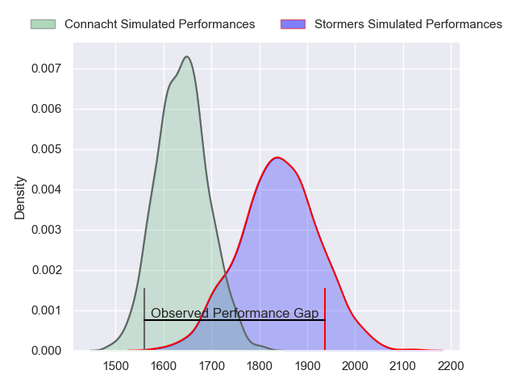
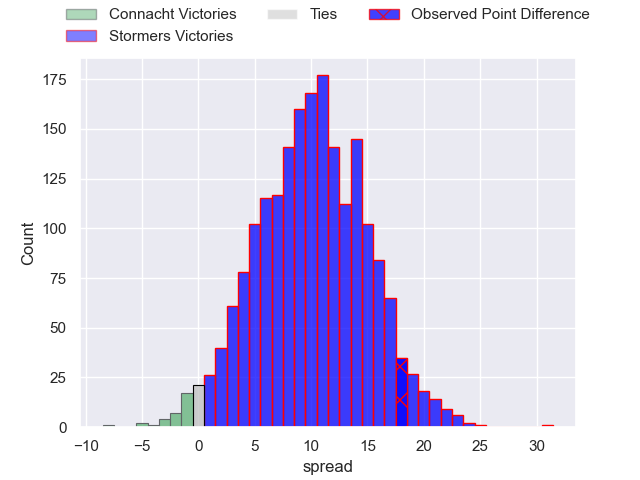

---  
layout: page  
title: Connacht at Stormers; 25-43  
date: 2023-05-13 16:00:00 18:00:00 -0500  
categories: match review  
---
# Connacht at Stormers; 25-43

# Club Level Predictions

The first set of predictions treats a club as the smallest object, as the club develops its members, organizes a gameplan, and deploys its players as needed for each match. This club model has a prediction of 0.756, which translates to predicting Stormers to win by 10.0.

Each club has a rating and a rating deviation (simiar to a Glicko system), and expected performances can be generated. This allows for simulated matches and spreads like the ones below.
## Projected Performances

## Projected Spreads

## Projected Results

# Player Level Predictions

Treating teams instead as an entity made up of the currently active players, I have ratings for each player in an altogether different system. These can be combined to form team ratings once teamsheets are announced, weighting starters a bit higher than the reserves. After the match is played, players can be weighted by their minutes on the field, allowing for an accurate measure of the team's composition. With these compiled team ratings, we can make predictions, measure inaccuracy, and update the individual player ratings.
## Prediction with Player Minutes: Connacht by 2.5

Connacht by 6.5 on a neutral field

There were 11 large changes in win probability in this match
## Prediction without Player Minutes: Connacht by 3.2

Connacht by 7.2 on a neutral pitch

|   Away Minutes | Away Player           |   Away elo |   Away Percentile |   Number |   Home Percentile |   Home elo | Home Player                  |   Home Minutes |
|---------------:|:----------------------|-----------:|------------------:|---------:|------------------:|-----------:|:-----------------------------|---------------:|
|             63 | Dennis Buckley        |      83.12 |                64 |        1 |                64 |      83.45 | Steven Kitshoff              |             78 |
|             63 | David Heffernan       |      78.37 |                54 |        2 |                67 |      84.22 | Joseph Dweba                 |             59 |
|             63 | Finlay Bealham        |     101.7  |                91 |        3 |                60 |      81.18 | Jozua Francois Malherbe      |             59 |
|             80 | Joshua Daniel Murphy  |      87.06 |                70 |        4 |                86 |     102.28 | Ben-Jason Dixon              |             80 |
|             47 | Niall Murray          |      89.79 |                74 |        5 |                52 |      77.65 | Ruben van Heerden            |             80 |
|             80 | Shamus Hurley-Langton |      90.21 |                75 |        6 |                36 |      72.06 | Willem Gerhardus Engelbrecht |             75 |
|             63 | Conor Oliver          |      89.87 |                75 |        7 |                67 |      85.53 | Hacjivah Dayimani            |             80 |
|             80 | Cian Prendergast      |      86.66 |                70 |        8 |                62 |      83.29 | Evan Roos                    |             73 |
|             63 | Caolin Blade          |      87.28 |                69 |        9 |                62 |      83.16 | Herschel Jerome Jantjies     |             62 |
|             70 | Jack Carty            |      94.51 |                78 |       10 |                70 |      89.28 | Immanuel Libbok              |             80 |
|             80 | Mack Hansen           |      75.45 |                48 |       11 |                61 |      81.88 | Leolin Lucien Zas            |             78 |
|             80 | Bundee Aki            |     122.55 |                97 |       12 |                67 |      87.3  | Daniel Michael du Plessis    |             78 |
|             80 | Thomas Farrell        |      93.16 |                75 |       13 |                14 |      57.64 | Adriaan Ruhan Nel            |             80 |
|             80 | John Porch            |      82.47 |                62 |       14 |                95 |     113.64 | Angelo Davids                |             80 |
|             34 | Tiernan O'Halloran    |      87.29 |                65 |       15 |                67 |      88.3  | Damian Willemse              |             80 |
|             46 | Byron Ralston         |      81.26 |                58 |       16 |                49 |      77.21 | JJ Kotze                     |             21 |
|             33 | Oisin Dowling         |      83.86 |                61 |       17 |                51 |      78.35 | Johan Neethling Fouche       |             21 |
|             17 | Dylan Tierney-Martin  |      82.74 |                59 |       18 |                56 |      80.19 | Albertus Paul de Wet         |             18 |
|             17 | Jack Aungier          |      77.84 |                48 |       19 |                55 |      78.99 | Connor Evans                 |              7 |
|             17 | Jordan Duggan         |      74.31 |               nan |       20 |                56 |      79.89 | Marcel Theunissen            |              5 |
|             17 | Jarrad Butler         |      82.41 |                57 |       21 |                54 |      80.54 | Jean-Luc du Plessis          |              2 |
|             17 | Kieran Marmion        |      76.93 |               nan |       22 |                65 |      86.5  | Sacha Mngomezulu             |              2 |
|             10 | Tom Daly              |      84.86 |               nan |       23 |                30 |      68.46 | Alistair Fernando Vermaak    |              2 |

