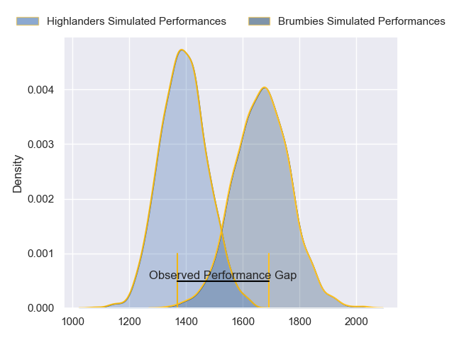
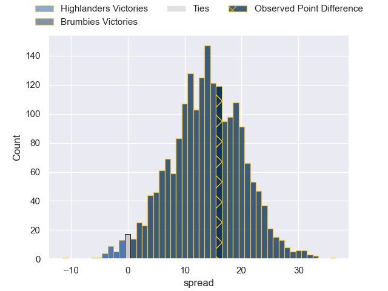

---  
layout: page  
title: Highlanders at Brumbies; 32.0-48.0  
date: 2023-05-14 00:35:00 18:00:00 -0500  
categories: match review  
---
# Highlanders at Brumbies; 32.0-48.0

# Club Level Predictions

The first set of predictions treats a club as the smallest object, as the club develops its members, organizes a gameplan, and deploys its players as needed for each match. This club model has a prediction of 0.823, which translates to predicting Brumbies to win by 13.7.

Each club has a rating and a rating deviation (simiar to a Glicko system), and expected performances can be generated. This allows for simulated matches and spreads like the ones below.
## Projected Performances

## Projected Spreads

## Projected Results

# Player Level Predictions

Treating teams instead as an entity made up of the currently active players, I have ratings for each player in an altogether different system. These can be combined to form team ratings once teamsheets are announced, weighting starters a bit higher than the reserves. After the match is played, players can be weighted by their minutes on the field, allowing for an accurate measure of the team's composition. With these compiled team ratings, we can make predictions, measure inaccuracy, and update the individual player ratings.
## Prediction with Player Minutes: Brumbies by 19.1

Brumbies by 15.1 on a neutral field

There were 12 large changes in win probability in this match
## Prediction without Player Minutes: Brumbies by 19.8

Brumbies by 15.8 on a neutral pitch

|   Away Minutes | Away Player          |   Away elo |   Away Percentile |   Number |   Home Percentile |   Home elo | Home Player      |   Home Minutes |
|---------------:|:---------------------|-----------:|------------------:|---------:|------------------:|-----------:|:-----------------|---------------:|
|             59 | Dan Lienert-Brown    |      90.75 |                80 |        1 |                99 |     139.79 | James Slipper    |             52 |
|             53 | Andrew Makalio       |      92.18 |                80 |        2 |                36 |      69.36 | Lachlan Lonergan |             57 |
|             53 | Saula Mau            |      84.67 |                75 |        3 |                99 |     125.48 | Allan Alaalatoa  |             57 |
|             80 | Shannon Frizell      |      98    |                85 |        4 |                50 |      76.67 | Darcy Swain      |             57 |
|             32 | Josh Dickson         |     100.16 |                87 |        5 |                33 |      69.53 | Nick Frost       |             80 |
|             63 | James Lentjes        |      87.47 |                72 |        6 |                86 |      99.69 | Rob Valetini     |             80 |
|             80 | Billy Harmon         |     108.41 |                93 |        7 |                95 |     112.15 | Jahrome Brown    |             57 |
|             80 | Hugh Renton          |      50.72 |                 8 |        8 |                76 |      90.6  | Pete Samu        |             80 |
|             78 | Folau Fakatava       |      79.13 |                55 |        9 |                97 |     119.41 | Nic White        |             36 |
|             76 | Freddie Burns        |     108.25 |                92 |       10 |                79 |      95.04 | Noah Lolesio     |             80 |
|             80 | Jona Nareki          |      85.31 |                66 |       11 |                66 |      84.49 | Corey Toole      |             80 |
|             80 | Thomas Umaga-Jensen  |      72.47 |                39 |       12 |                70 |      89.46 | Ollie Sapsford   |             80 |
|             80 | Fetuli Paea          |      91.15 |                72 |       13 |                90 |     106.51 | Len Ikitau       |             80 |
|             68 | Scott Gregory        |      79.57 |                58 |       14 |                94 |     111.65 | Andy Muirhead    |             80 |
|             80 | Connor Garden-Bachop |     100.05 |                87 |       15 |                85 |     102.41 | Tom Wright       |             80 |
|             27 | Rhys Marshall        |      88.49 |                77 |       16 |                98 |     119.42 | Connal McInerney |             23 |
|             21 | Ayden Johnstone      |      92.36 |                84 |       17 |                78 |      91.92 | Blake Schoupp    |             28 |
|             27 | Jermaine Ainsley     |      87.52 |                73 |       18 |                62 |      84.11 | Rhys Van Nek     |             23 |
|             48 | Marino Mikaele-Tu'u  |      79.26 |                52 |       19 |                50 |      76.38 | Tom Hooper       |             23 |
|             17 | Sean Withy           |      74.97 |                50 |       20 |                86 |     101.35 | Luke Reimer      |             23 |
|              2 | James Arscott        |      89.86 |                73 |       21 |                86 |     100.49 | Ryan Lonergan    |             44 |
|              4 | Mitch Hunt           |      99.84 |                85 |       22 |                77 |      92.06 | Jack Debreczeni  |              0 |
|             12 | Jonah Lowe           |      84.7  |                67 |       23 |               nan |      91.29 | Hudson Creighton |              0 |

