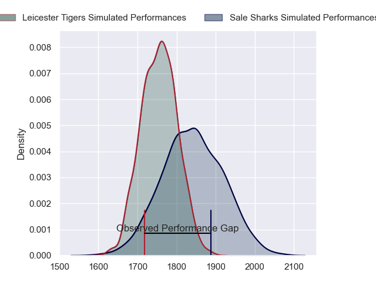
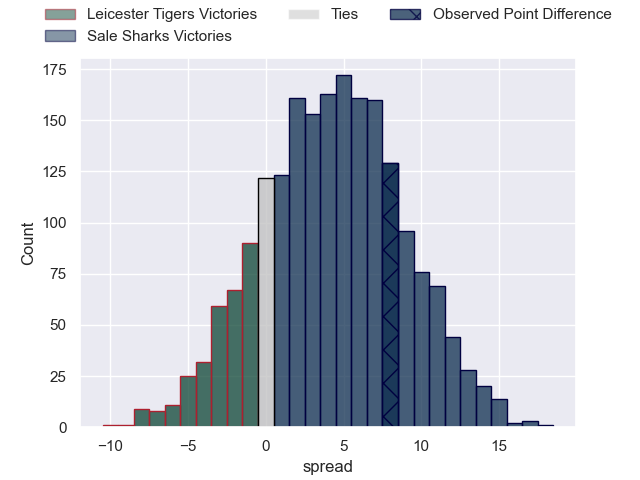
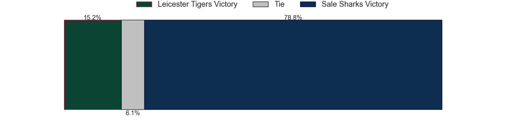

---  
layout: page  
title: Leicester Tigers at Sale Sharks; 13.0-21.0  
date: 2023-05-14 10:00:00 18:00:00 -0500  
categories: match review  
---
# Leicester Tigers at Sale Sharks; 13.0-21.0

# Club Level Predictions

The first set of predictions treats a club as the smallest object, as the club develops its members, organizes a gameplan, and deploys its players as needed for each match. This club model has a prediction of 0.615, which translates to predicting Sale Sharks to win by 4.1.

Each club has a rating and a rating deviation (simiar to a Glicko system), and expected performances can be generated. This allows for simulated matches and spreads like the ones below.
## Projected Performances

## Projected Spreads

## Projected Results

# Player Level Predictions

Treating teams instead as an entity made up of the currently active players, I have ratings for each player in an altogether different system. These can be combined to form team ratings once teamsheets are announced, weighting starters a bit higher than the reserves. After the match is played, players can be weighted by their minutes on the field, allowing for an accurate measure of the team's composition. With these compiled team ratings, we can make predictions, measure inaccuracy, and update the individual player ratings.
## Prediction with Player Minutes: Sale Sharks by 3.6

Leicester Tigers by 0.4 on a neutral field

There were 7 large changes in win probability in this match
## Prediction without Player Minutes: Sale Sharks by 3.8

Leicester Tigers by 0.2 on a neutral pitch

|   Away Minutes | Away Player         |   Away elo |   Away Percentile |   Number |   Home Percentile |   Home elo | Home Player         |   Home Minutes |
|---------------:|:--------------------|-----------:|------------------:|---------:|------------------:|-----------:|:--------------------|---------------:|
|             53 | Tom West            |     106.37 |                93 |        1 |                87 |      99.12 | Simon McIntyre      |             47 |
|             80 | Julian Montoya      |      97.02 |                86 |        2 |                84 |      96.04 | Akker van der Merwe |             55 |
|             57 | Dan Cole            |      73.54 |                42 |        3 |                54 |      78.15 | Nic Schonert        |             47 |
|             80 | George Martin       |      91.65 |                77 |        4 |                89 |     103.36 | Jean-Luc du Preez   |             80 |
|             70 | Cameron Henderson   |     106.94 |                92 |        5 |                65 |      84.45 | Jonny Hill          |             80 |
|             80 | Hanro Liebenberg    |     101.26 |                88 |        6 |                45 |      74.39 | Tom Curry           |             72 |
|             80 | Tommy Reffell       |     110.54 |                94 |        7 |                79 |      92.69 | Ben Curry           |             29 |
|             72 | Jasper Wiese        |     102.64 |                90 |        8 |                54 |      79.45 | Jono Ross           |             80 |
|             37 | Ben Youngs          |      86.13 |                67 |        9 |                69 |      87.69 | Gus Warr            |             51 |
|             70 | Jimmy Gopperth      |      79.81 |                55 |       10 |                94 |     111.95 | George Ford         |             80 |
|             80 | Harry Potter        |      83.17 |                63 |       11 |                86 |      98.36 | Arron Reed          |             80 |
|             80 | Dan Kelly           |      97.39 |                81 |       12 |                93 |     110.6  | Manu Tuilagi        |             55 |
|             67 | Matt Scott          |      76.02 |                47 |       13 |                73 |      91.99 | Robert du Preez     |             80 |
|             80 | Anthony Watson      |      70.34 |                37 |       14 |                85 |      98.14 | Tom Roebuck         |             80 |
|             80 | Freddie Steward     |     107.13 |                89 |       15 |                31 |      69.16 | Joe Carpenter       |             80 |
|              0 | Charlie Clare       |      62.81 |                24 |       16 |                83 |      94.95 | Ewan Ashman         |             25 |
|             27 | James Cronin        |     114.09 |                97 |       17 |                92 |     103.71 | Bevan Rodd          |             33 |
|             23 | Joe Heyes           |      85.76 |                69 |       18 |                95 |     108.59 | Coenie Oosthuizen   |             33 |
|             10 | Harry Wells         |     126.2  |                98 |       19 |                92 |     107.26 | Josh Beaumont       |              8 |
|              8 | Olly Cracknell      |      96.96 |                87 |       20 |                91 |     106.8  | Daniel du Preez     |             45 |
|             43 | Jack van Poortvliet |     103.62 |                89 |       21 |                88 |     102.92 | Raffi Quirke        |             29 |
|             10 | Charlie Atkinson    |     100.36 |                79 |       22 |                97 |     125.46 | Sam James           |             25 |
|             13 | Guy Porter          |     105.55 |                89 |       23 |                79 |      92.72 | Tom O'Flaherty      |              6 |

