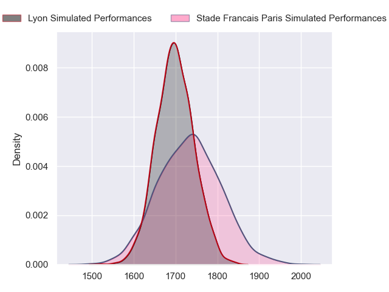
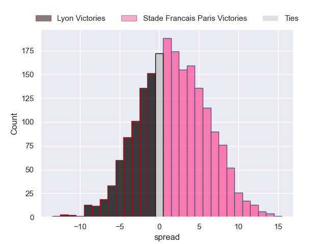
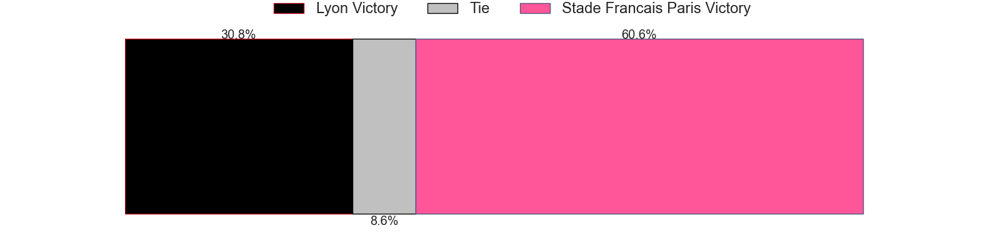

---  
layout: page  
title: Lyon at Stade Francais Paris; 31-31  
date: 2023-05-14 21:05:00 18:00:00 -0500  
categories: match review  
---
# Lyon at Stade Francais Paris; 31-31

# Club Level Predictions

The first set of predictions treats a club as the smallest object, as the club develops its members, organizes a gameplan, and deploys its players as needed for each match. This club model has a prediction of 0.546, which translates to predicting Stade Francais Paris to win by 1.6.

Each club has a rating and a rating deviation (simiar to a Glicko system), and expected performances can be generated. This allows for simulated matches and spreads like the ones below.
## Projected Performances

## Projected Spreads

## Projected Results

# Player Level Predictions

Treating teams instead as an entity made up of the currently active players, I have ratings for each player in an altogether different system. These can be combined to form team ratings once teamsheets are announced, weighting starters a bit higher than the reserves. After the match is played, players can be weighted by their minutes on the field, allowing for an accurate measure of the team's composition. With these compiled team ratings, we can make predictions, measure inaccuracy, and update the individual player ratings.
## Prediction with Player Minutes: Stade Francais Paris by 30.1

Stade Francais Paris by 26.1 on a neutral field

There were 8 large changes in win probability in this match
## Prediction without Player Minutes: Stade Francais Paris by 38.2

Stade Francais Paris by 34.2 on a neutral pitch

|   Away Minutes | Away Player               |   Away elo |   Away Percentile |   Number |   Home Percentile |   Home elo | Home Player                   |   Home Minutes |
|---------------:|:--------------------------|-----------:|------------------:|---------:|------------------:|-----------:|:------------------------------|---------------:|
|             55 | Sébastien Taofifenua      |      52.87 |                 8 |        1 |                51 |      77.11 | Moses Eneliko Alo-Emile       |             58 |
|             55 | Yanis Charcosset          |       7.96 |               nan |        2 |                53 |      81.28 | Mickaël Ivaldi                |             52 |
|             55 | Demba Bamba               |      27.72 |                 0 |        3 |                64 |      83.13 | Paul Alo-Emile                |             52 |
|             58 | Félix Lambey              |      74.3  |                10 |        4 |                61 |      81.94 | Paul Gabrillagues             |             80 |
|             80 | Romain Taofifenua         |     109.36 |                93 |        5 |                26 |      68.8  | Baptiste Pesenti              |             60 |
|             80 | Dylan Cretin              |      26.55 |                 0 |        6 |                37 |      70.91 | Mathieu Hirigoyen             |             58 |
|             80 | Beka Saghinadze           |      96.23 |                83 |        7 |                49 |      76.56 | Romain Briatte                |             80 |
|             67 | Liam Allen                |      82.06 |                54 |        8 |                59 |      81.01 | Sekou Macalou                 |             80 |
|             76 | Baptiste Couilloud        |      50.76 |                 6 |        9 |                36 |      70.82 | Arthur Coville                |             69 |
|             41 | Jean-Marc Doussain        |     -19.14 |                 0 |       10 |                47 |      77.64 | Léo Barré                     |             66 |
|             80 | Ethan Dumortier           |     105.63 |                91 |       11 |                38 |      70.77 | Nadir Megdoud                 |             80 |
|             80 | Tavite Veredamu           |      87.23 |                72 |       12 |                37 |      71.34 | Alex Arrate                   |             80 |
|             80 | Thibaut Regard            |      25.18 |               nan |       13 |                56 |      81.24 | Jeremy Charles Ward           |             61 |
|             41 | Noa Nakaitaci             |      13.12 |                 0 |       14 |                62 |      82.44 | Peniasi Dakuwaqa              |             80 |
|             80 | Toby Arnold               |      83.42 |                57 |       15 |                40 |      74.42 | Kylan Hamdaoui                |             80 |
|             39 | Lima Sopoaga              |      49.11 |                 2 |       16 |                61 |      81.31 | Giorgi Melikidze              |             28 |
|             39 | Josua Tuisova             |      89.13 |                69 |       17 |                 8 |      53.23 | Laurent Panis                 |             28 |
|             25 | Francisco Gomez Kodela    |      35.59 |                 0 |       18 |                10 |      54.11 | Pierre-Henri Azagoh           |             22 |
|             25 | Feao Fotuaika             |      20.45 |               nan |       19 |                 9 |      58.05 | Vasil Kakovin                 |             22 |
|             25 | Guillaume Marchand        |      12.77 |                 0 |       20 |               nan |      65.96 | Juan John (JJ) van der Mescht |             20 |
|             22 | Temo Sukayawa Mayanavanua |      25.84 |                 0 |       21 |                 5 |      52.06 | Paolo Odogwu                  |             19 |
|             13 | Patrick Sobela            |     -13.05 |                 0 |       22 |                27 |      66.47 | Joris Segonds                 |             14 |
|              4 | Jonathan Pelissié         |      30.18 |                 0 |       23 |               nan |      62.33 | James Hall                    |             11 |

