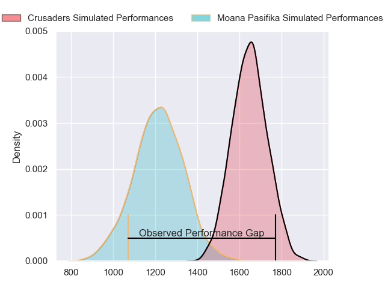
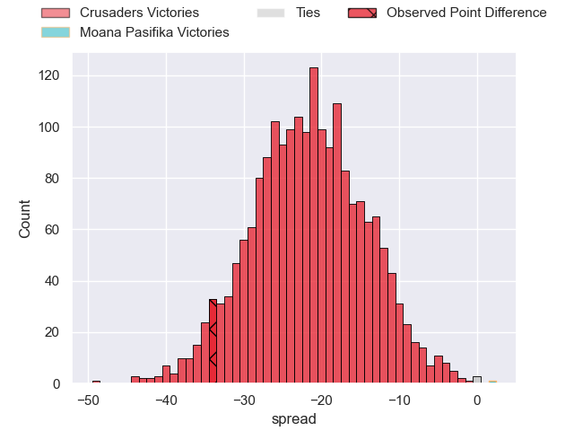

---  
layout: page  
title: Crusaders at Moana Pasifika; 41.0-7.0  
date: 2023-05-19 03:05:00 18:00:00 -0500  
categories: match review  
---
# Crusaders at Moana Pasifika; 41.0-7.0

# Club Level Predictions

The first set of predictions treats a club as the smallest object, as the club develops its members, organizes a gameplan, and deploys its players as needed for each match. This club model has a prediction of 0.08, which translates to predicting Crusaders to win by 22.0.

Each club has a rating and a rating deviation (simiar to a Glicko system), and expected performances can be generated. This allows for simulated matches and spreads like the ones below.
## Projected Performances

## Projected Spreads

## Projected Results

# Player Level Predictions

Treating teams instead as an entity made up of the currently active players, I have ratings for each player in an altogether different system. These can be combined to form team ratings once teamsheets are announced, weighting starters a bit higher than the reserves. After the match is played, players can be weighted by their minutes on the field, allowing for an accurate measure of the team's composition. With these compiled team ratings, we can make predictions, measure inaccuracy, and update the individual player ratings.
## Prediction with Player Minutes: Crusaders by 12.7

Crusaders by 16.7 on a neutral field

There were 4 large changes in win probability in this match
## Prediction without Player Minutes: Crusaders by 15.6

Crusaders by 19.6 on a neutral pitch

|   Away Minutes | Away Player           |   Away elo |   Away Percentile |   Number |   Home Percentile |   Home elo | Home Player           |   Home Minutes |
|---------------:|:----------------------|-----------:|------------------:|---------:|------------------:|-----------:|:----------------------|---------------:|
|             55 | Kershawl Sykes-Martin |      82.99 |                64 |        1 |                66 |      84.23 | Abraham Pole          |             41 |
|             55 | Brodie McAlister      |     101.89 |                89 |        2 |                16 |      57.27 | Samiuela Moli         |             41 |
|             48 | Tamaiti Williams      |      94.15 |                84 |        3 |                45 |      73.17 | Chris Apoua           |             41 |
|             80 | Scott Barrett         |     125.88 |                98 |        4 |                24 |      63.94 | Alex McRobbie         |             80 |
|             80 | Zach Gallagher        |      86.13 |                67 |        5 |                46 |      74.81 | Mike McKee            |             80 |
|             62 | Christian Lio-Willie  |      78.18 |                53 |        6 |                41 |      72.82 | Miracle Faiilagi      |             66 |
|             64 | Corey Kellow          |      68.41 |                32 |        7 |                36 |      70.01 | Alamanda Motuga       |             80 |
|             80 | Cullen Grace          |     113.82 |                96 |        8 |                56 |      80.92 | Solomone Funaki       |             80 |
|             59 | Noah Hotham           |     102.66 |                87 |        9 |                77 |      93.58 | Ere Enari             |             41 |
|             80 | Fergus Burke          |      79.23 |                49 |       10 |                87 |     103.12 | Christian Leali'ifano |             80 |
|             80 | Macca Springer        |      88.9  |                74 |       11 |                60 |      80.8  | Neria Fomai           |             41 |
|             55 | Dallas McLeod         |     101.07 |                88 |       12 |                96 |     117.15 | Levi Aumua            |             80 |
|             68 | Jack Goodhue          |      99.93 |                84 |       13 |                31 |      67.59 | Fine Inisi            |             80 |
|             80 | Chay Fihaki           |     106.04 |                87 |       14 |                91 |     103.89 | Tima Fainga'anuku     |             66 |
|             80 | Will Jordan           |     126.76 |                97 |       15 |                86 |     104.16 | William Havili        |             80 |
|             25 | Ioane Moananu         |      69.19 |               nan |       16 |                88 |      99.01 | Luteru Tolai          |             39 |
|             25 | Andrew Turner         |      93.63 |               nan |       17 |                42 |      73.66 | Ezekiel Lindenmuth    |             39 |
|             32 | Seb Calder            |      93.52 |               nan |       18 |                88 |      97.06 | Joe Apikotoa          |             39 |
|             16 | Dom Gardiner          |      85.21 |                67 |       19 |                35 |      67.4  | Potu Leavasa          |             25 |
|             18 | Tom Christie          |      99.96 |                87 |       20 |                60 |      82.16 | Jonah Mau'u           |             14 |
|             21 | Mitchell Drummond     |      85.73 |                67 |       21 |                26 |      66.29 | Jonathan Taumateine   |             39 |
|             25 | Taha Kemara           |      80.27 |                55 |       22 |                 6 |      50.02 | Henry Taefu           |             14 |
|             12 | Willi Gualter         |      66.12 |                28 |       23 |                59 |      80.71 | Timoci Tavatavanawai  |             39 |

